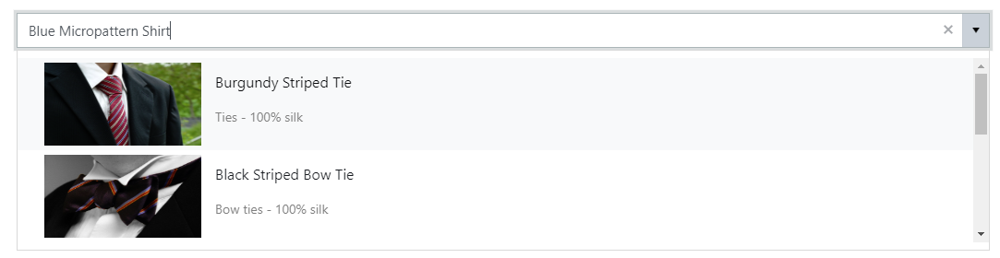
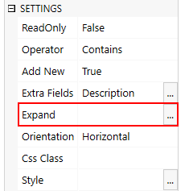

How to customize the appearance of search results for lookup fields in SharePoint form
======================================================================================================

.. contents:: Contents:
 :local:
 :depth: 1
 
Introduction
--------------------------------------------------
Plumsail Forms offer advanced customization for SharePoint lookup fields. Using JavaScript, you can achieve great results in the way lookups present information.

You are not limited to displaying just one field, multiple fields can be displayed at once and all of this can be customized to fit your needs.

In this article, we will show you an example with several fields displayed at once, including a picture, so it looks like this in the end:

|example|

Getting extra fields
--------------------------------------------------
By default, the Lookup only gets Id and Display column of the source list. In my case, I want to get *Description* text field, *Price* currency field, 
*Image* URL/Picture field and *Category* Lookup field.

In order to do that, I need to edit Extra Fields property of the Lookup SETTINGS:

|pic1|

.. |pic1| image:: ../images/how-to/lookup-view/extra-fields.png
   :alt: Extra Fields

I add the following lines to it, it will retrieve the fields that I need:

.. code-block:: javascript

    Description
    Price
    Image
    Category/Id
    Category/Title

Now, once these fields are added, I will also need to use Expand property to get access to the Category field:

|pic2|

Here, I just need to add Internal Names of the fields that need to Expand, in this case:

.. code-block:: javascript

    Category

View configuration
--------------------------------------------------
Now, that this is available, we'll need to customize lookup's template in order to display retrieved fields. 
Lookup's template is based on |Kendo UI Combobox's Template|. 
Please note that you can store the template in a separate script element inserted with an HTML-control and retrieve it in your code.

.. |Kendo UI Combobox's Template| raw:: html

   <a href="https://docs.telerik.com/kendo-ui/api/javascript/ui/combobox/configuration/template" target="_blank">Kendo UI Combobox's Template</a>

In this example, I will use string withing JavaScript editor to define template for selectable items:

.. code-block:: javascript

    fd.spBeforeRender(function() {
        var template = '';
        template += '# if (data.Image) { #  # } #';
        template += '';
        template += '
 #: data.LookupValue # 
';
        template += '
 #: data.Category ? data.Category.Title : "" #';
        template += '#: data.Description ? " - " + data.Description : "" #
';
        template += '
 #: data.Price ? "$" + data.Price : "" # 
';
        template += '';
        fd.field('Lookup').widgetOptions = {
            template: template,
            height: 400,
            virtual: {
                itemHeight: 100
            },
            dataSource: {
                pageSize: 16
            }
        }
    });

In this template, I've tried to structure everything clearly - starting from an image, going to the next column, 
wrapping some fields inside span - this will allow us to position fields in a column rather than line.

.. Important:: When adjusting **itemHeight**, **pageSize** should also be adjusted to match new **itemHeight**, using this formula: **((height / itemHeight) * 4)**

Finally, with the added classes, I add the following CSS inside CSS Editor:

.. code-block:: CSS

    .k-dropdown .k-dropdown-wrap .k-input{
        height: auto !important;
    }

    .lookup-col{
        flex-direction: column; 
        margin-bottom: 5px; 
        padding-top: 10px; 
        margin-left: 10px;
    }

    .lookup-title{
        margin-bottom: 3px; 
        font-size: 16px;
    }

    .lookup-desc{
        margin-bottom: 3px; 
        font-size: 14px; 
        color: gray;
    }

    .lookup-price{
        margin-bottom: 5px; 
        font-size: 15px; 
        font-weight: bold;
    }

    .lookup-image{ 
        margin: 5px;
    }