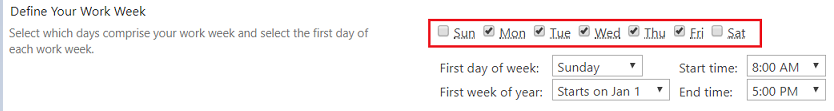

Manipulate Date and DateTime fields
=========================================================================

.. contents:: Contents:
 :local:
 :depth: 1

Description
--------------------------------------------------

In this article, you will find the most common examples of working with the Date & Time field.  

Using the |Moment.js| library and its plugins, you can easily calculate duration between dates, add or subtract time from the date, calculate a number of business days/hours between dates, etc.

Add to or Subtract from a Date
--------------------------------------------------

With the help of the Moment.js library, you can add and subtract date and time values to calculate future and past dates.  
In Moment.js you can specify a time unit that you want to use in the calculation. Find more info on using the time units |here|.

Assume we want to populate a due date field as today plus 3 days on loading a new form. This can be done with Moment.js: 

.. code-block:: javascript

    function setDueDate() {   

        var today = moment(new Date());
        var newDate = today.add(3, 'days');
        fd.field('DueDate').value = newDate.format(); 
    } 

    fd.spRendered(function() {   

        // To avoid conflicts with requireJS which is available by default in SharePoint  
        // we unset 'define' function until the script are loaded
        var define = window.define;   
        window.define = undefined;  

        $.getScript('https://cdnjs.cloudflare.com/ajax/libs/moment.js/2.24.0/moment-with-locales.min.js')   
        .then(function() { 
            window.define = define; 
            
            // Calling function on form loading 
            setDueDate();
        }) 
    });

Using a similar approach, you can calculate dates by adding or subtracting time in any units - days, weeks, etc. You can find more examples in the |documentation|.

Calculate the number of days between two dates 
--------------------------------------------------

You can also calculate the difference between two dates in years, months, days, etc. using the |diff| method.  

Suppose you need to know how many days have passed since the purchase until the delivery date. 

.. code-block:: javascript

    function diffDays() {

        var purchase = moment(fd.field('PurchaseDate').value); 
        var delivery = moment(fd.field('DeliveryDate').value);
        var dateDiff = delivery.diff(purchase, 'days', false);
        
        fd.field('DeliveryPeriod').value = dateDiff; 
    }
    
    fd.spRendered(function() {

        // To avoid conflicts with requireJS which is available by default in SharePoint
        // we unset 'define' function until the script are loaded        
        var define = window.define;  
        window.define = undefined;
        
        $.getScript('https://cdnjs.cloudflare.com/ajax/libs/moment.js/2.24.0/moment-with-locales.min.js')
        .then(function() {
            window.define = define;
            
            // Calling function when the user changes the date
            fd.field('PurchaseDate').$on('change', diffDays);
            fd.field('DeliveryDate').$on('change', diffDays);
            
            // Calling function on form loading
            DiffDays (); 
        }) 
    });  

Calculate the number of business days between dates
-----------------------------------------------------

Also, you can find the difference between two dates, excluding weekends and holidays. For this, we will use |moment-business-days.js|, which is a Moment.js plugin that allows working with business days only.  

You can customize the working week, and also set custom dates for holidays to exclude them from being counted as business days, for example, national holidays.  

In the code example below, we defined a four-day workweek, Monday through Thursday, and specified the holidays. 

.. code-block:: javascript

    function calcDiff() {
        
        var startDate = moment(fd.field('StartDate').value);
        var endDate = moment(fd.field('EndDate').value);
        var diff = endDate.businessDiff(startDate);
        
        console.log(diff);
    }
    
    function defineWorkDays () {
        
        //Define holidays that you do not want to be considered working days
        var july4th = '07-04-2019';
        var laborDay = '09-07-2019';
        
        moment.updateLocale('us', {

            // Defines days from 1 (Monday) to 6 (Saturday) as business days. Note that Sunday is day 0.
            // When omitting this configuration parameter, business days are based on locale default
            workingWeekdays: [1, 2, 3, 4], 
            holidays: [july4th, laborDay],
            holidayFormat: 'MM-DD-YYYY'
        });
    } 
    
    fd.spRendered(function() {
        
        // To avoid conflicts with requireJS which is available by default in SharePoint
        // we unset 'define' function until the script are loaded
        var define = window.define;
        window.define = undefined;
        
        $.getScript('https://cdnjs.cloudflare.com/ajax/libs/moment.js/2.24.0/moment-with-locales.min.js')
        
        .then(function() { return $.getScript('https://cdn.jsdelivr.net/npm/moment-business-days@1.1.3/index.min.js')})
        .then(function() {
            
            window.define = define;
            // Defining Work Days and Holidays on form loading
            defineWorkDays ();
            
            // Calling function when the user changes the date
            fd.field('StartDate').$on('change', calcDiff);
            fd.field('EndDate').$on('change', calcDiff);  

            // Calling function on form loading
            calcDiff();
        })
    }); 

You can add and subtract the given number of days skipping business days using the same plugin. Please find more details |here1|.

Calculate the number of business days between dates based on Regional Settings
----------------------------------------------------------------------------------------------------

You can define a workweek in the site's regional settings. Go to Site Settings >> Site Administration >> Regional Settings. 

|pic0|

Based on those settings, you can calculate business days between two dates using this code:

.. code-block:: javascript

    function calcDiff() {
        
        var startDate = moment(fd.field('StartDate').value);
        var endDate = moment(fd.field('EndDate').value);
        var diff = endDate.businessDiff(startDate);
        
        console.log(diff);
    }
    
    fd.spRendered(function() {
        
        // To revent conflicts with requireJS which is available by default in SHarePoint
        // we unset 'define' function until the script are loaded
        var define = window.define;
        window.define = undefined;
        
        $.getScript('https://cdnjs.cloudflare.com/ajax/libs/moment.js/2.24.0/moment-with-locales.min.js')
        
        .then(function() { return $.getScript('https://cdn.jsdelivr.net/npm/moment-business-days@1.1.3/index.min.js')})
        .then(function() {
            
            window.define = define;
            
            //get business days from regional settings
            return pnp.sp.web.regionalSettings.get();
        })
        .then(function(rs) {
            
            window.rs = rs;
            var workingWeekdays = [];
            for (var d = 0; d < 7; d++) {
                if (Math.pow(2, 6-d) & rs.WorkDays) {
                    
                    workingWeekdays.push(d);  
                } 
            }
            
            moment.updateLocale(_spPageContextInfo.currentUICultureName, {
                
                workingWeekdays: workingWeekdays
            });

            // Calling function when the user changes the date   
            fd.field('StartDate').$on('change', calcDiff);
            fd.field('EndDate').$on('change', calcDiff);  

            // Calling function on form loading
            calcDiff();
        }) 
    }); 

Calculate the number of business hours between dates  
-----------------------------------------------------

Using the |moment-business-time.js| plugin, we can calculate the working hours between two dates.  

By default, the working hours are 09:00-17:00, Monday through Friday. But you can specify custom working hours as shown in this code example: 

.. code-block:: javascript

    function calcDiff() {
        
        var startDate = moment(fd.field('StartDate').value);
        var endDate = moment(fd.field('EndDate').value);
        diff = endDate.workingDiff(startDate, 'hours');
        
        console.log(diff);
    } 
    
    //Function that defines working hours     
    function defineWorkHours () {
        
        moment.locale('en', {
            workinghours: {
                
                0: null,
                1: ['09:30:00', '16:00:00'],
                2: ['09:30:00', '17:00:00'],
                3: ['09:30:00', '13:00:00'],
                4: ['09:30:00', '17:00:00'],
                5: ['09:30:00', '17:00:00'],
                6: null
            }
        });
    }
    
    fd.spRendered(function() {
        
        // To avoid conflicts with requireJS which is available by default in SharePoint
        // we unset 'define' function until the script are loaded
        var define = window.define;
        window.define = undefined;

        $.getScript('https://cdnjs.cloudflare.com/ajax/libs/moment.js/2.24.0/moment-with-locales.min.js')
        
        .then(function() { return $.getScript('https://forms.plumsail.com/libs/moment-business-time.js') })
        .then(function() { 
            
            window.define = define;
            defineWorkHours ();
            
            // Calling function when the user changes the date
            fd.field('StartDate').$on('change', calcDiff);
            fd.field('EndDate').$on('change', calcDiff);
            
            // Calling function on form loading
            calcDiff();
        })
    });

You can add and subtract working hours using the same plugin. Please find more details |here2|.

.. |Moment.js|  raw:: html

   <a href="https://momentjs.com" target="_blank">Moment.js</a>

.. |here|  raw:: html

   <a href="https://momentjs.com/docs/#/manipulating/add/" target="_blank">here</a>

.. |documentation|  raw:: html

   <a href="https://momentjs.com/docs/#/manipulating/" target="_blank">documentation</a>

.. |diff|  raw:: html

   <a href="https://momentjs.com/docs/#/displaying/difference/" target="_blank">diff</a>
   
.. |here1|  raw:: html

   <a href="https://www.npmjs.com/package/moment-business-days#businessadddays--moment" target="_blank">here</a>

.. |moment-business-time.js|  raw:: html

   <a href="https://www.npmjs.com/package/moment-business-time" target="_blank">moment-business-time.js</a>

.. |here2|  raw:: html

   <a href="https://www.npmjs.com/package/moment-business-time#momentaddworkingtime" target="_blank">here</a>

.. |moment-business-days.js|  raw:: html

   <a href="https://www.npmjs.com/package/moment-business-days" target="_blank">moment-business-days.js</a>