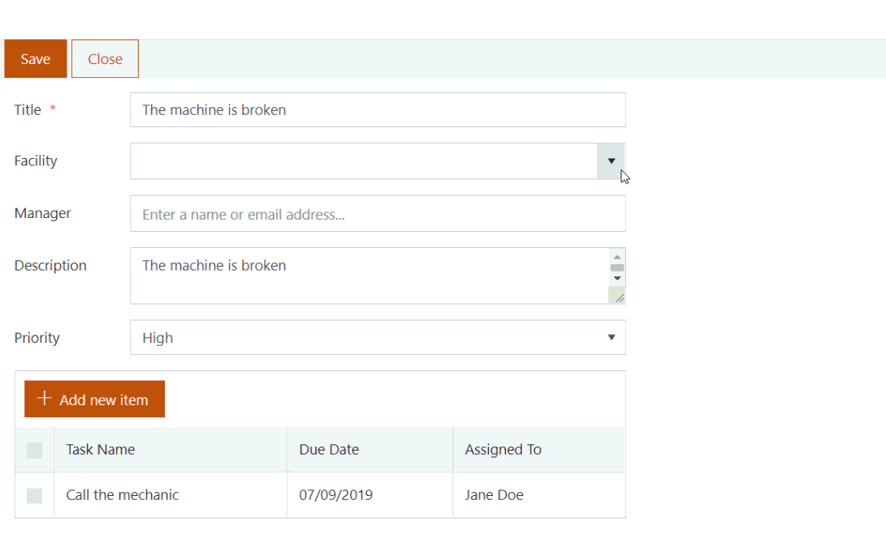
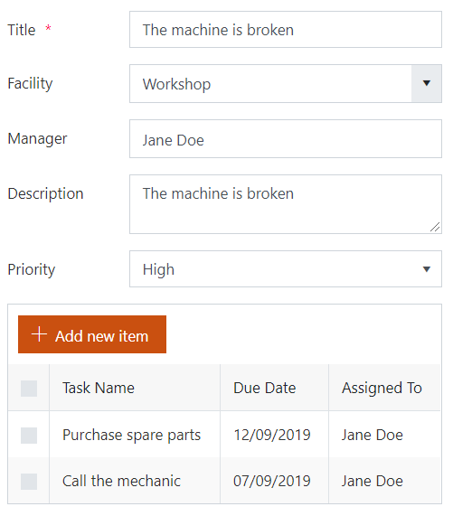
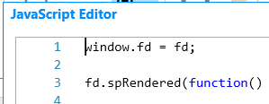
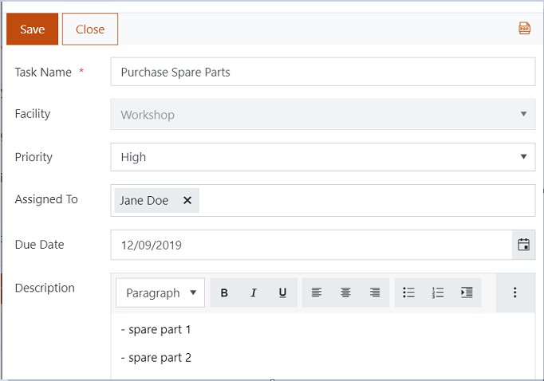

.. title:: Pass SharePoint values to a dialog form

.. meta::
   :description: An instructions for passing values ​​from a parent form to a child form, which is opened in the dialog box

How to retrieve field values of SharePoint form from another form opened in dialog
=====================================================================================

In this article, you will find the instructions for passing values ​​from a parent form to a child form, which is opened in the dialog box.

|pic0|

Suppose that a company possesses a set of facilities and requires a facility management system. In case of any problem at a facility, a user creates an issue in this system. This issue is assigned to a specific manager who is responsible for this facility. Each issue can have several tasks.

Facilities list will only store the information about facilities and their managers: Title and Manager fields only. Issues list will be the parent list for the Tasks list.

To speed up the task creation, we will set up prepopulation of the necessary information from a parent form, e.g. 'Facility', 'Priority', and 'Assigned to'.

.. contents::
 :local:
 :depth: 1

Parent form
--------------------------------------------------

Here is a simple Issue form containing all the fields from the Issues list plus a 'List or Library' control bound to the Tasks list and displaying issue's tasks.

|pic1|

To be able to pass values from a parent form to a child form, we need to define *fd* globally in the parent form with the code: 

.. code-block:: javascript

    window.fd = fd; 

|pic2|

Since each facility has a manager, we'll populate the Manager field, when the Facility changes. To do this, we will add the following code into JavaScript editor: 

.. code-block:: javascript

    window.fd = fd; 

    fd.spRendered(function() { 
        
        fd.field('Facility').$on('change', function () { 
            fd.field('Manager').value = fd.field('Facility').value.Manager.EMail; 
        }) 
    }); 

Child form
--------------------------------------------------

Here is a form of the Tasks list: 

|pic3|

Here we will populate Priority, Facility (lookup field), and Assigned To fields with values from the parent form. 

To get access to the parent form's fields, we will use 'window.top' property which returns the topmost window object. This code will get values from parent form: 

.. code-block:: javascript

    fd.spRendered(function() {
        var parentForm = window.top.fd;
        
        if (parentForm) {

            //Set field values with the values from the parent on form load
            fd.field('Facility').value = parentForm.field('Facility').value.ID;
            fd.field('Priority').value = parentForm.field('Priority').value;
            fd.field('AssignedTo').value = parentForm.field('Manager').value; 
            
            //Disable Location field
            fd.field('Facility').disabled = true;
        }
    }); 