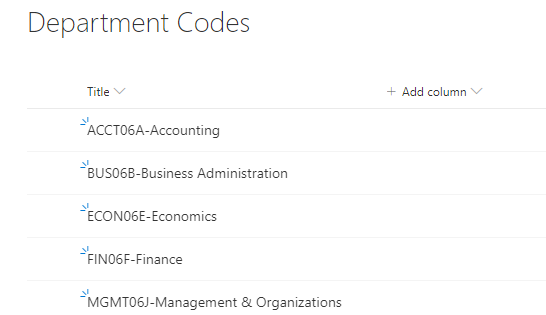
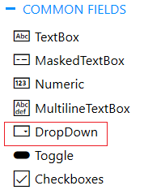
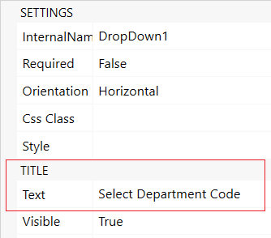
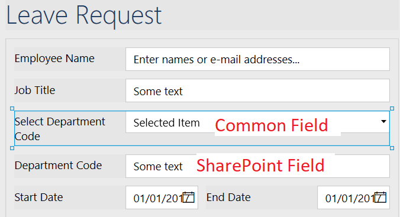
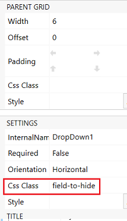
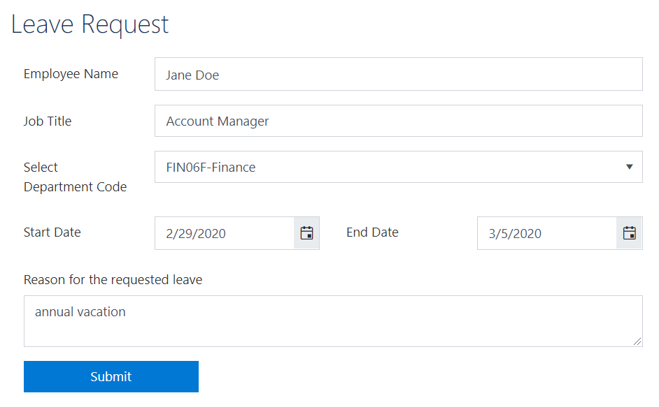

Populate dropdown with data from SharePoint list from another site collection 
=================================================================================

.. contents:: Contents:
 :local:
 :depth: 1

Introduction
--------------------------------------------------

In this article, I will show you how to populate a regular dropdown field with the data from a SharePoint list. This can be helpful in cases when you're not able to use lookup columns. For instance, you need to get data from another SharePoint site collection, or you want to reduce the number of lookup columns. 

Assume that you have different forms across a SharePoint tenant, e.g. request forms, purchase orders forms, leave request forms, etc. Each form has a dropdown field with department codes. The list with department codes is located at the root site collection, and you want to re-use its data in your forms.

Source List and Target Form 
--------------------------------------------------

First, we create a list at the root site that is storing department codes. 

|pic0|

Then, on another site, we create a Leave Request list with these columns: 

- Employee Name (people picker field); 

- Job Title (text field); 

- Department Code (text field); 

- Reason for the requested leave (Multiline text field); 

- Start Date (date field); 

- End Date (date field). 

Next, we move on to the form design. We add all SharePoint fields to the form. Plus, as we want a user to see the list of department codes in a dropdown, we add a DropDown field from the Common Fields section.

|pic1|

Let's set its title to 'Select Department Code'. 

|pic2|

Thus, we have two fields in the form: 

- The common field that displays department codes in a drop-down 

- The SharePoint field that stores the selected department code. 

|pic3|

We need the Department Code (SharePoint field) in the form for saving the selected value from the regular dropdown field populated with the department codes when a user changes it. But we don't need it to be visible. So, we will assign a CSS class to it, e.g. field-to-hide.

|pic4|

And will use this code in CSS editor to hide the field: 

.. code-block:: javascript

    .field-to-hide { 
        display: none !Important; 
    } 

Here is our resulting form: 

|pic5|

Populating dropdown with the data from the SharePoint list 
-------------------------------------------------------------

To prepopulate a dropdown field with the data from a SharePoint list that is located on a different site, we use |PnPjs library| that is built into Plumsail Forms.  

.. code-block:: javascript

    function populateDepartmentCodes(){
        
        //specify your site URL
        var siteURL = 'https://sitename.sharepoint.com/sites/Main/';
        let web = new Web(siteURL);
        
        web.lists.getByTitle('Department Codes').items.select('Title').get().then(function(items) {
            
            fd.field('DropDown1').widget.setDataSource({
                data: items.map(function(i) { return i.Title })
            });
            
            //set the dropdown with the previously selected value
            fd.field('DropDown1').value = fd.field('DepartmentCode').value;
        });
    }
    
    fd.spRendered(function() {
        
        //call function on from load
        populateDepartmentCodes();
        
        //fill SharePoint field with the selected value
        fd.field('DropDown1').$on('change', function() {
            fd.field('DepartmentCode').value = fd.field("DropDown1").value;
        });
    });  

.. |PnPjs library| raw:: html

    <a href="https://pnp.github.io/pnpjs/" target="_blank">PnPjs library</a>