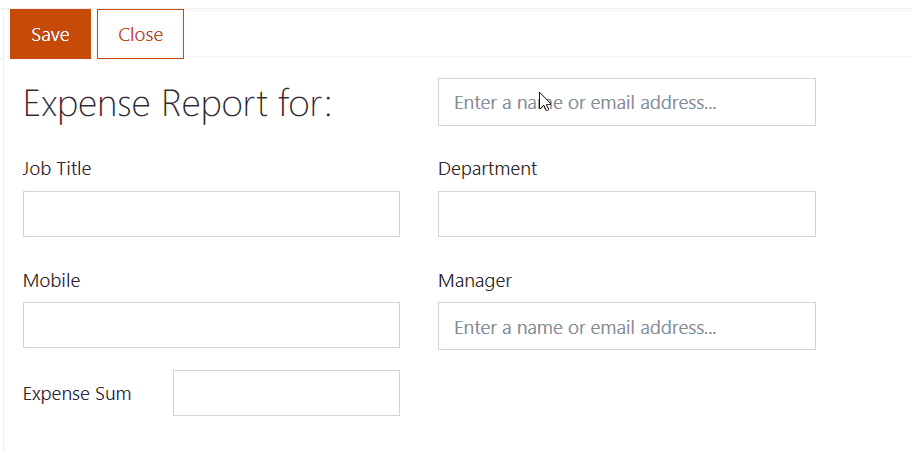

.. title:: Populate SharePoint form fields with profile information

.. meta::
   :description: Use JavaScript to populate fields with information about the current user such as name, job title, department, phone, manager name and more

How to populate SharePoint form fields with profile information
=========================================================================

In this article, we will show you how to retrieve information from a user profile and prepopulate form fields with it. 

|pic0|

.. contents::
 :local:
 :depth: 1

Editing user profile properties
--------------------------------
If you're a global administrator in Microsoft 365 and want to modify user profiles, add or change their properties, navigate to |Admin Center|.

.. |Admin Center| raw:: html

    <a href="https://docs.microsoft.com/en-us/sharepoint/add-and-edit-user-profile-properties" target="_blank">Admin Center</a>

If you're a regular user in Office 365 and want to update your profile information, navigate to |Delve|.

.. |Delve| raw:: html

    <a href="https://support.microsoft.com/en-us/office/view-and-update-your-profile-in-office-delve-4e84343b-eedf-45a1-aeb9-8627ccca14ba?ui=en-us&rs=en-us&ad=us" target="_blank">Delve</a>

If you're an administrator of SharePoint 2019 on-premises, navigate to |User Profile service|.

.. |User Profile service| raw:: html

    <a href="https://docs.microsoft.com/en-us/SharePoint/administration/user-profile-service-administration" target="_blank">User Profile service</a>

.. Note:: Administrators can create custom profile properties, populate them with PowerShell, and configure synchronization with Active Directory.

For more information, check out |Microsoft's article on how to manage user profile properties|.

.. |Microsoft's article on how to manage user profile properties| raw:: html

    <a href="https://docs.microsoft.com/en-us/sharepoint/manage-user-profiles" target="_blank">Microsoft's article on how to manage user profile properties</a>

Accessing current user profile properties
---------------------------------------------
You can retrieve current user profile properties with the following code:

.. code-block:: javascript

    function updateCurrentUserInfo() {
        pnp.sp.profiles.myProperties.get().then(function(result) {
            
            var props = result.UserProfileProperties;
            
            for (var i = 0; i < props.length; i++) {
                
                switch (props[i].Key) {
                    case 'Manager':
                        fd.field('Manager').value = props[i].Value;
                        break;
                    
                    case 'Department':
                        fd.field('Department').value = props[i].Value;
                        break;
                    
                    case 'Title':
                        fd.field('JobTitle').value = props[i].Value;
                        break;
                    
                    case 'CellPhone':
                        fd.field('Mobile').value = props[i].Value;
                }
            } 
        });
    } 
    
    fd.spRendered(function() {
        //executes updateCurrentUserInfo on form load
        updateCurrentUserInfo();
    }); 

Accessing Person field user profile properties
------------------------------------------------
You can also retrieve user profile properties for a user selected in the user field:

.. Note: Form user must have access to these properties to retrieve them successfully

.. code-block:: javascript

    function updateUserInfo() {
        var employee = fd.field('User').value;

        if (employee && employee.Key){
            pnp.sp.profiles.getPropertiesFor(employee.Key).then(function(result) {
            
                var props = result.UserProfileProperties;
                
                for (var i = 0; i < props.length; i++) {
                    
                    switch (props[i].Key) {
                        case 'Manager':
                            fd.field('Manager').value = props[i].Value;
                            break;
                        
                        case 'Department':
                            fd.field('Department').value = props[i].Value;
                            break;
                        
                        case 'Title':
                            fd.field('JobTitle').value = props[i].Value;
                            break;
                        
                        case 'CellPhone':
                            fd.field('Mobile').value = props[i].Value;
                    }
                } 
            });
        }
    } 
    
    fd.spRendered(function() {
        //executes updateUserInfo on field change
        fd.field('PersonFieldName').$on('change', updateUserInfo);
    }); 

Use Graph API to access user profile properties
------------------------------------------------
You can use |Microsoft Graph API|, which is already included on your forms to access user profile properties from Azure Active Directory.

.. |Microsoft Graph API| raw:: html

    <a href="https://pnp.github.io/pnpjs/graph/" target="_blank">Microsoft Graph API</a>

For example, the following code will allow you to retrieve and populate fields with information from the current user's profile:

.. code-block:: javascript

    fd.spRendered(function() {
        graph.me().then(function(props) {
            fd.field('JobTitle').value = props.jobTitle;
        });
    });

And the following code can be used to retrieve profile properties for a user selected in Person field:

.. code-block:: javascript

    fd.spRendered(function() {
        fd.field('PersonFieldName').$on('change', function(user) {
            if (user && user.EntityData && user.EntityData.Email){
                graph.users.getById(user.EntityData.Email)().then(function(props){
                    fd.field('JobTitle').value = props.jobTitle;
                });
            }	
        });
    });

.. Important::  In order to retrieve user profile properties with Graph API, you first need to make sure that the Microsoft Graph app has the permissions to access data on your tenant.

                For this, make sure to install Microsoft 365 CLI (you'll need to install Node.js first in order to do that).

                Connect it to your Office 365 tenant from the command line:

                .. code-block:: javascript

                    m365 login

                And then use the following line to give Microsoft Graph the required permissions:

                .. code-block:: javascript

                    m365 spo serviceprincipal grant add --resource "Microsoft Graph" --scope "User.Read"