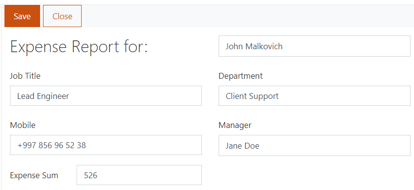

.. title:: Populate SharePoint form fields with profile information

.. meta::
   :description: Use JavaScript to populate fields with information about the current user such as name, job title, department, phone, manager name and more

How to populate SharePoint form fields with profile information
=========================================================================

In this article, we will show you how to retrieve information from a user profile and prepopulate form fields with it. 

Let's say an HR administrator needs to fill in an expense report form on behalf of an employee. The report contains user information fields that we want to be populated automatically from the user's profile once the administrator selects a user in a Person or Group field. 

|pic0|

.. |pic0| image:: ../images/how-to/populate-user-info/populate-user-info-0.gif
   :alt: preview

.. note:: You can see all user profile properties in the "SharePoint Admin Centre > Classic features > User Profiles > Manage User Profiles > Edit User Profile".

.. contents::
 :local:
 :depth: 1

Expense Report Form 
--------------------------------------------------

First, create a simple form with the following fields:  

- Employee Name (person or group field);
- Job Title (plain text field);
- Department (plain text field);
- Mobile (plain text field);
- Manager Name (person or group field);
- Expense Sum (currency field). 

|

Here is our form:  

|pic1|

Next, insert the following code into JavaScript editor to populate user information and manager name from the selected user's profile. The 'updateUserInfo' function is triggered by changing the Employee Name field. 

.. code-block:: javascript

    function updateUserInfo() {
        var employee = fd.field('EmployeeName').value;  
        
        pnp.sp.profiles.getPropertiesFor(employee.Key).then(function(result) {
            
            var props = result.UserProfileProperties;
            
            for (var i = 0; i < props.length; i++) {
                
                switch (props[i].Key) {
                    case 'Manager':
                        fd.field('Manager').value = props[i].Value;
                        break;
                    
                    case 'Department':
                        fd.field('Department').value = props[i].Value;
                        break;
                    
                    case 'Title':
                        fd.field('JobTitle').value = props[i].Value;
                        break;
                    
                    case 'CellPhone':
                        fd.field('Mobile').value = props[i].Value;
                }
            } 
        });
    } 
    
    fd.spRendered(function() {
        
        //executes updateUserInfo on field change        
        fd.field('EmployeeName').$on('change', updateUserInfo);
    }); 