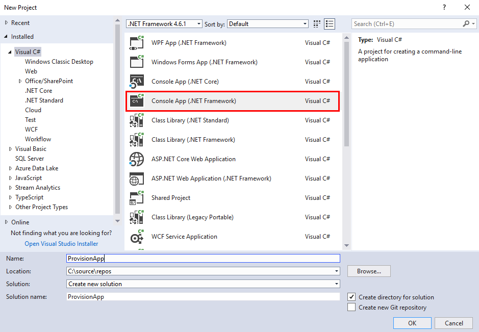

Provisioning SharePoint forms designed in Plumsail Forms
=======================================================================

.. contents:: Contents:
 :local:
 :depth: 1
 
Description
--------------------------------------------------
Sometimes, you create a form and want to re-use. Maybe, you have several project sites and some forms are the same across all of them. 
Or perhaps you want to move forms from one site to another. Of course, you can always use Export and Import functionality of the designer, 
but this takes time - to open each form and to import it.

This article will help you provision Form from one site to another programmatically, using Visual Studio and our NuGet package. 
First of all, you do need both Lists to be identical, perhaps deployed programmatically, otherwise this method won't work as intended. 
Second of all, forms need to be exported first - this is not mandatory and you can retrieve forms from the old site. 

Export the form
--------------------------------------------------
First action that you need to do is export the form. Open the form in the designer and click the Export button: 

|pic1|

.. |pic1| image:: ../images/how-to/provision/export.png
   :alt: Export button

Then select folder where it will be stored:

|pic2|

Create application and install NuGet package
--------------------------------------------------
Now, run the Visual Studio. Make sure that you have *.NET Framework v.4.5.2* or higher installed. In the Visual Studio, create a new Project and select 
Console App (.NET Framework):

|pic3|

In the newly created project, open Tools, find NuGet Package Manager and select Manage NuGet Packages for Solution...

Open the Browse tab, search for 'plumsail', and install **Plumsail.Forms.O365** (or **Plumsail.Forms.SP2019** for SharePoint 2019) package:

|pic4|

Adjust the code
--------------------------------------------------
Once the package and its dependencies have installed, go to Program.cs and replace all the code there with the following

.. code-block:: c#

    using Microsoft.SharePoint.Client;
    using System;
    using System.Linq;
    using System.Net.Http;
    using System.Net.Http.Headers;
    using System.Security;
    using System.Threading.Tasks;
    using System.Xml.Linq;
    using Plumsail.Forms.SharePoint;
    using Plumsail.Forms.Data.SharePoint;

    namespace ProvisionApp
    {
        class Program
        {
            static void Main(string[] args)
            {
                // ENTER YOUR SHAREPOINT LOGIN FOR THE NEW SITE:
                var login = "your-login@your-domain.onmicrosoft.com";
                // YOUR PASSWORD:
                var password = GetSecureString("qwerty");
                // TITLE OF THE LIST:
                var listTitle = "LookupTest";
                // NAME OF THE CONTENT TYPE:
                var contentType = "Item";
                // PATH TO THE EXPORTED FORM:
                var formPath = "c:\\provision\\Item_New.xfds";
                // URL OF THE NEW SITE:
                var webUrl = "https://your-domain.sharepoint.com/sites/your-site";

                using (var ctx = new ClientContext(webUrl))
                {
                    ctx.Credentials = new SharePointOnlineCredentials(login, password);

                    // Specify a list which form you want to replace
                    var list = ctx.Web.Lists.GetByTitle(listTitle);
                    var cts = list.ContentTypes;

                    ctx.Load(list);
                    ctx.Load(cts);
                    ctx.ExecuteQuery();

                    // Specify a content type which form you want to replace
                    var cType = cts.FirstOrDefault(ct => ct.Name == contentType);

                    var forms = new FormsManager(ctx, list.Id, cType.Id.ToString());

                    var layout = XDocument.Load(formPath);

                    // THE FORM WILL REPLACE A DEFAULT NEW FORM IN THE TARGET LIST:
                    forms.GenerateForms(Guid.Empty, FormTypes.New, layout);

                }
            }

            private static SecureString GetSecureString(string s)
            {
                SecureString result = new SecureString();
                foreach (char c in s.ToCharArray())
                {
                    result.AppendChar(c);
                }
                return result;
            }
        }
    }

Run the app
--------------------------------------------------
After saving the file, run the app. Congratulations, you've successfully provisioned your first form!

The example shown in this article is very basic and requires you to export the form first, 
while technically you can retrieve form's layouts and form sets settings from the original site.
To learn more about various methods available to FormsManager in :doc:`this article </designer/provision>`.