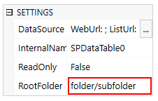
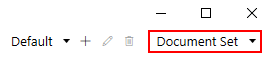

List or Library Root Folder
=======================================================

.. contents:: Contents:
 :local:
 :depth: 1

Introduction
--------------------------------------------------
Previous two articles showed how to filter List or Library by a :doc:`Lookup </how-to/child-parent-form>` or with :doc:`CAML Query </how-to/caml-filter>`.
This article is going to show you how to limit displayed results to a specific folder and how to change this folder dynamically.

Root Folder is the property that specifies which folder is opened in List or Library control by default. 
Users can go into subfolders of Root Folder, but they cannot go higher than Root Folder.

This can be useful when you want to separate items by folders or when working with Document sets, for example.
Root Folder can also be used in conjuction with both CAML and Lookup filtering.

Read more about properties and events in :ref:`javascript-listorlibrary` JavaScript documentation.

*Important note!* You cannot create new folders with List or Library control, it only uses existing folders. If you need to create New Folder, use MS Flow instead.

Set Root Folder
--------------------------------------------------
Easiest way to set the Root Folder is to change SETTINGS → RootFolder in the Designer:

This can also be done with JavaScript. For example, if you have folders with IDs of the items 
and only want to display contents of the folder with the name matching current item's ID, you can do it with the following code:

.. code-block:: javascript

    fd.spRendered(function() {
        var dt = fd.control('SPDataTable0');
        dt.ready().then(function() {
            setRootFolder();
        });

        function setRootFolder(){
            //set base root folder to the current item's ID:
            dt.baseRootFolder = String(fd.itemId);
            //set current folder to the current item's ID:
            dt.rootFolder = String(fd.itemId);
        }
    });

Set Root Folder for Document Set
--------------------------------------------------
You can also use List or Library to only display documents that are inside currently opened Document set. This is applicable to Edit and Display Form only though, 
so it can't be used before Document Set is created.

For this to work, first open Document Library in the Designer and select Document Set Content Type in the upper right corner:

Now, add List or Library control to the Form and the following code to the JavaScript editor:

.. code-block:: javascript

    //use spBeforeRender event to get access to the SharePoint form context
    fd.spBeforeRender(function(ctx) {
        var dt = fd.control('SPDataTable0');
        dt.ready().then(function() {
            setRootFolder();
        });

        function setRootFolder(){
            dt.baseRootFolder = ctx.ItemAttributes.Url;
            dt.rootFolder = ctx.ItemAttributes.Url;
        }
    });

Change Root Folder dynamically
--------------------------------------------------
Final example that I want to show is how to change Root Folder property dynamically. 

Let's say, we have Category field on our form which is a Dropdown Choice field. Each choice has a folder with a matching name inside List or Library Source List.

With this code we can make Root Folder automatically change when Category field changes:

.. code-block:: javascript

    fd.spRendered(function(ctx) {
        var dt = fd.control('SPDataTable0');
        dt.ready().then(function() {
            setRootFolder();
        });

        //set root folder when Category field changes
        fd.field('Category').$on('change', function() {
            setRootFolder();
        });

        function setRootFolder(){
            var category = fd.field('Category').value;
            if(category){
                dt.baseRootFolder = category;
                dt.rootFolder = category;
            }
        }
    });