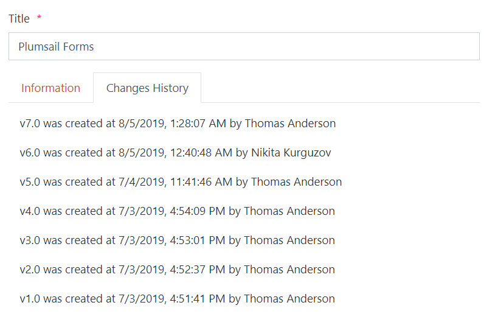
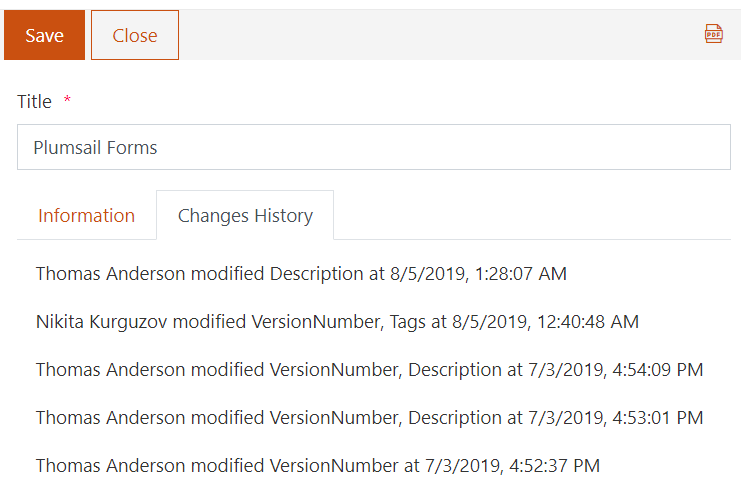

Display version history on the form
=================================================================================================

.. contents:: Contents:
 :local:
 :depth: 1

Description
--------------------------------------------------
In this article, we'll show you a basic example of how to display version history of an item on the form. You will be able to see who and when modified an item, like this:

|pic0|

It's also possible to get all the changes info using more advanced JavaScript - more on that later!

Form
--------------------------------------------------
Create your SharePoint form, in this case I've created something simple like this:

|pic1|

.. |pic1| image:: ../images/how-to/version-history/how-to-version-history-1.png
   :alt: Form in editor

I've added Tab Control and placed HTML control on the second tab:

|pic2|

.. |pic2| image:: ../images/how-to/version-history/how-to-version-history-2.png
   :alt: Second tab and HTML control

This HTML control is important - it will contain our Version history, I've used the following HTML code:

.. code-block:: HTML

    

    

Copy and paste this code to ensure that the following JS code works for you as well!

JavaScript
--------------------------------------------------
We'll use the following JavaScript code to request all the versions of the current item as soon as it loads, and add a record for each version to our Version history:

.. code-block:: javascript

    //listurl and id are retrieved from fd
    var listUrl = fd.webUrl + fd.listUrl;
    var id = fd.itemId;
    fd.spRendered(function(){
        pnp.sp.web.getList(listUrl)
        .items.getById(id)
        .select('*, Versions')
        .expand('Versions')
        .get().then(function(results){
            var versions = results.Versions;
            for(var i = 0; i < versions.length; i++){
                var text = "";
                var currentVersion = versions[i];
                var label = versions[i].VersionLabel;
                var date =  "<i>" + new Date(versions[i].Modified).toLocaleString() + "</i>";
                var editor =  "<b>" + versions[i].Editor.LookupValue + "</b>";
                if(i == versions.length - 1){
                    text += "v" + label + " was created at: " + date + " by " + editor;
                }
                else{
                    text += "v" + label + " was modified at: " + date + " by " + editor;
                }
                $("#changes").append("
" + text +"
");
            }
        });
    });

This code also pulls information about all the fields, so if you need more data, for example, what fields were changed and what exactly the changes were - that's also doable!

Field value change
************************************************
The following code will not only detect version change, but will also check Description field for changes, and if it was changed - will display the change:

.. code-block:: javascript

    var listUrl = fd.webUrl + fd.listUrl;
    var id = fd.itemId;
    fd.spRendered(function(){
        pnp.sp.web.getList(listUrl)
        .items.getById(id)
        .select('*, Versions')
        .expand('Versions')
        .get().then(function(results){
            var versions = results.Versions;
            for(var i = 0; i < versions.length; i++){
                var text = "";
                var currentVersion = versions[i];
                var label = versions[i].VersionLabel;
                var description = versions[i].Description;
                if(i == versions.length - 1){
                    text += "v" + label + " was created";
                    text += " - Description: " + description;
                }
                else{
                    text += "v" + label + " was modified";
                    if(description != versions[i + 1].Description){
                        text += " - New description: " + description;
                    }
                }
                $("#changes").append("
" + text +"
");
            }
        });
    });

And here's how it will look like in SharePoint:

|pic3|

Experiment
************************************************
Feel free to experiment to achieve the results you are looking for!

This code will give you access to all Versions inside the console:

.. code-block:: javascript

    var listUrl = fd.webUrl + fd.listUrl;
    var id = fd.itemId;
    fd.spRendered(function(){
        pnp.sp.web.getList(listUrl)
        .items.getById(id)
        .select('*, Versions')
        .expand('Versions')
        .get().then(function(results){
            console.log(results.Versions);
        });
    });

So you can dig in and see what's available for yourself:

|pic4|

.. |pic4| image:: ../images/how-to/version-history/how-to-version-history-4.png
   :alt: Version history in browser's console