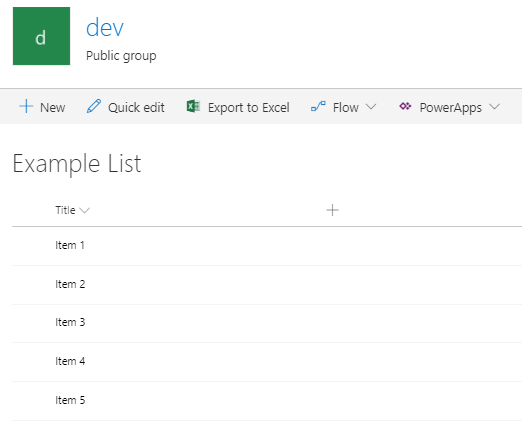
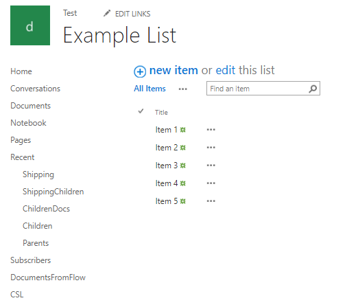

.. title:: Intro to modern forms for SP Online (Office 365) and SP 2019

.. meta::
   :description: What are modern forms and how to create them with Plumsail Forms

Introduction to modern forms for SharePoint Online in Office 365 and SharePoint 2019
====================================================================================================

.. contents:: Contents:
 :local:
 :depth: 1
 
Introduction
--------------------------------------------------
Plumsail Forms allows you to design beautiful modern responsive forms for SharePoint Modern UI.
These forms will work for SharePoint Lists and Libraries allowing you to replace New, Edit and Display
forms, to fully customize them, add interactivity to them and much more.

      .. toctree::
            :caption: First Steps
            :maxdepth: 1

            ./installation-sp
            ./installation-2019
            ./design-sp
            ./licensing-sp

Modern UI
--------------------------------------------------
In SharePoint Online and SharePoint 2019, Modern UI was introduced by Microsoft to keep the user experience fresh and
bring convenience that was missing in the classic UI. For example, Modern UI is faster, it's 
responsive and works well with mobile devices.

Here's how Modern UI(left) compares to the Classic UI(right):

|pic1| |pic2|

Currently, Modern UI is supported in SharePoint Online and SharePoint 2019 and can be switched to Classic UI at any point. 
Modern UI does not only affect the visual presentation of SharePoint, it also changes some of SharePoint's functionality, 
thus it requires a different approach when it comes to customization.

Plumsail Forms are specifically designed to work with Modern UI. All forms are build with Modern UI in mind, they are fast, 
responsive and have few limitations to their complexity. But you can use Plumsail Forms with Classic UI as well, for example, 
for Lists which are not yet supported by Modern UI, such as Tasks List - but all the forms will open in Modern UI, 
no matter what settings you have currently set.

.. note:: If you are interested in customizing SharePoint Forms for Classic UI - check out our |Forms Designer| product. 
          It has similar functionality and allows you to design complex custom forms for Classic UI in just a few minutes. 
          It also works well for SharePoint 2013/2016/2019 (Classic UI). We still fully support Forms Designer, even after release of Plumsail Forms, 
          it will remain essential to us and many of our clients for a long time to come.

.. |Forms Designer| raw:: html

   <a href="https://spform.com/" target="_blank">Forms Designer</a>

Fully customizable, yet simple to use
--------------------------------------------------
Plumsail Forms offers a large range of customization when it comes to designing forms. First of all,
designing a form is extremely easy. Fields and controls can be just dragged and dropped inside the form. 
Then, you can use containers such as Tabs and Accordions to separate different parts. 

Finally, all elements inside the form are placed on a |Bootstrap Grid| which allows you to easily position elements in relation to each other 
and ensure they scale well with all screen sizes. In regards to scaling, Plumsail Forms also offers an easy way to :ref:`customize forms for tablets 
and phones <designer-layouts>`, ensuring that mobile users get the best experience.

.. |Bootstrap Grid| raw:: html

   <a href="https://getbootstrap.com/docs/4.0/layout/grid/" target="_blank">Bootstrap Grid</a>

SharePoint :doc:`themes are supported </designer/themes>` and Forms' elements will adjust their colors according the current theme. Further customization is available with custom CSS 
and JavaScript. With our powerful :doc:`JavaScript API </javascript/general>` you'll be able to check field values on the form, dynamically adjust forms' content, validate submissions 
and much more.

Various custom controls are available for use on the form, such as :ref:`Ink Sketch <designer-inksketch>` that allows users to leave 
signatures or drawings, for example, mark details on top of an image. Another interesting control is :ref:`List or Library <designer-listorlibrary>` 
that allows users to see contents of another SharePoint List or Library, filter its contents and add items or upload documents to it. That is very useful 
for adding Children elements and binding them to parent element, the process that happens automatically with correct configuration, no code required.

Last, but not least, you get the ability to create more than one form for a list. In fact, you can create different forms for users from different groups 
and automatically redirect users to the correct form. Not only that, but you can write custom rules for redirection, based on item's values 
and/or user's properties, and make sure that you provide the appropriate form in all circumstances.

Find out :doc:`how to install the product for Office 365 </installation-sp>` or :doc:`how to install the product for SharePoint 2019 </installation-2019>`.