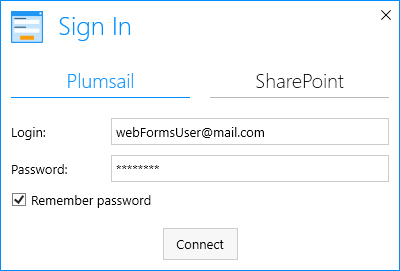
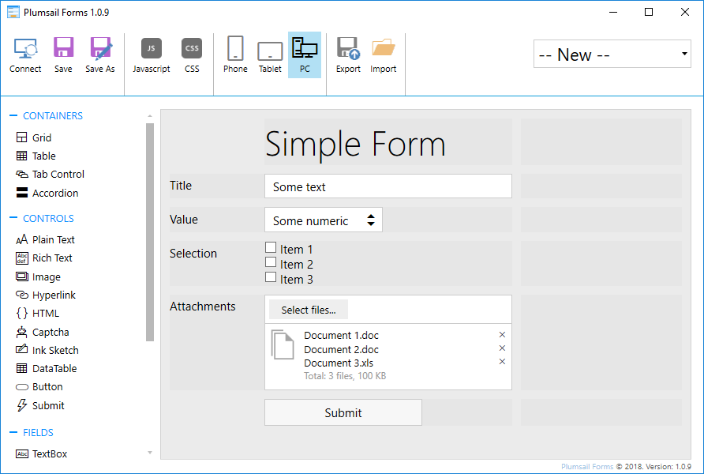
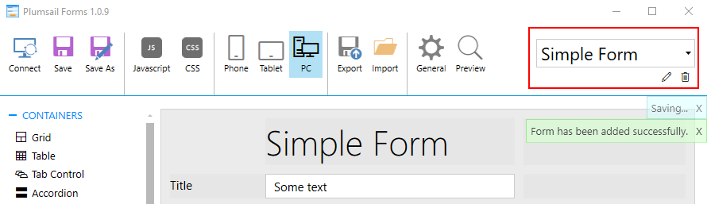
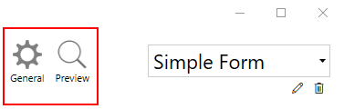
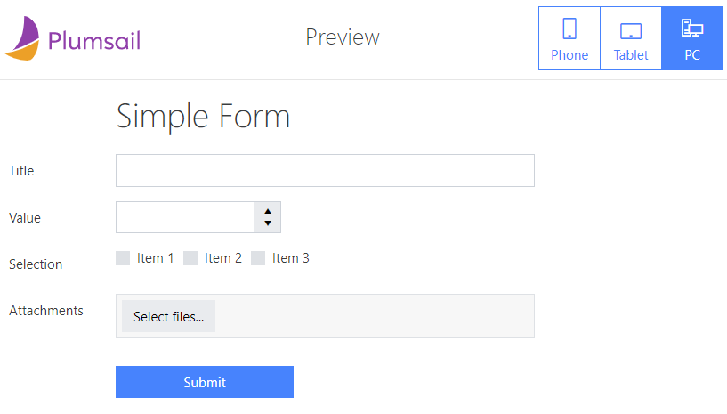
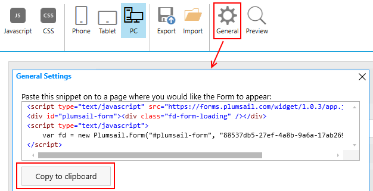
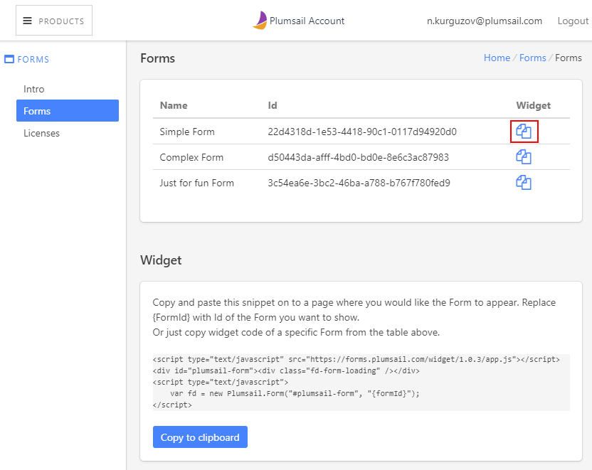
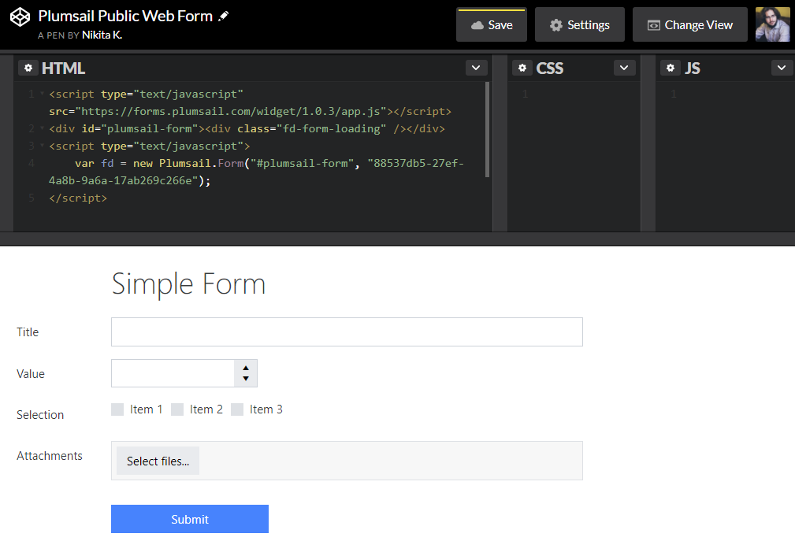

Design and publish Public Web Forms
====================================

.. contents:: Contents:
 :local:
 :depth: 1

Open the designer
--------------------------------------------------
First of all, you need to make sure that you've registered a Plumsail Account, downloaded and installed the designer application to your PC.

When you launch the application, it sometimes will offer you to update to the latest version, if a new update was released.
We do recommend you to update the app as often as possible in order to ensure that you are getting the most stable version and all the latest features.

The app launches with the following window:

|pic1|

In order to design Public Web Forms, select the Plumsail tab and enter Login and Password of your Plumsail Account. 

Design the form
--------------------------------------------------
When you open the designer, you can start designing the form. Fields, Controls and Containers can be simply dragged and dropped onto the form. 

|pic2|

Then you can adjust individual settings for each field, control or container by selecting it and modifying its configuration:

|pic3|

.. |pic3| image:: ./images/start/field-settings.png
   :alt: Field settings

Designer section of our documentation much more about each field, control and container, and their properties that you can modify.
Finally, there is also a section on Ribbon buttons that explains how you can work with mobile layouts, apply custom JavaScript and CSS to the form.

|pic4|

.. |pic4| image:: ./images/start/designer-ribbon.png
   :alt: Designer Ribbon

Once you've designed the form, click **Save**. You'll be able to give a name to your form and it will be saved to your Plumsail Account. 
You are always be able to open, edit or delete your saved forms in the upper right corner of the designer:

|pic5|

Publish the form
--------------------------------------------------
Once you save the form, you'll see two additional buttons on the Ribbon - *General* and *Preview*:

|pic6|

Preview allows you to see how your form will look in the browser. It will look different from its presentation in the designer, 
so make sure that you like the final result before publishing:

|pic7|

When you are satisfied with how your form looks on all the layouts and screen sizes (you can just resize browser's window to see how the form scales),
you can finally publish the form. For that, you need to copy the widget with FormID to the HTML code of the page where you want to publish it.

The widget can be found in General Settings in the designer where you can copy it to clipboard:

|pic8|

You can also copy form's widget from Plumsail Account Forms section in |Forms subsection| where all your forms are stored. 

Simply click the copy button next to a form:

|pic9|

.. |Forms subsection| raw:: html

   <a href="https://account.plumsail.com/forms/forms-page" target="_blank">Forms subsection</a>

After copying the widget, simply insert it as HTML to your page and the form will be published, ready to receive submissions:

|pic10|

Now, to actually work with received data, please, check out our :doc:`Handling data in Microsoft Flow </microsoftFlow>` article.