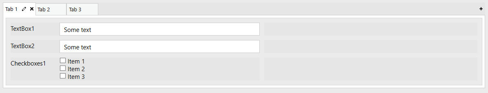
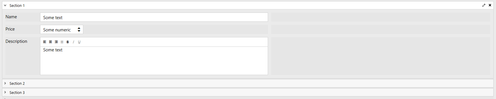

Containers
==================================================
Containers are elements that contain other elements inside of them. Containers can contain any elements inside, including other containers.

Grid
-------------------------------------------------------------
Grids are the most basic element of Plumsail Forms. By default, every form already has a grid.

But you are not limited to one grid per Form either. By placing Grid container inside the form, you are technically inserting 
one grid within another and then can lay out elements within second grid, which will be constrained by its own Parent Grid. 

So, despite Parent grid only having 12 options for Width property, you can adjust your layout precisely by using multiple grid containers.

Parent Grid properties
~~~~~~~~~~~~~~~~~~~~~~~~~~~~~~~~~~~~~~~~~~~~~~~~~~
Every element within a Grid has following properties:

.. list-table::
    :header-rows: 1
    :widths: 10 40
        
    *   - Property
        - Description
    *   - Width
        - Determines how much width an element takes, where 12 is full grid and other values represent smaller portions of the grid. If you add new elements or adjust Width of other elements and run out of space, Width of elements to the right will automatically adapt in the designer, so make sure that your elements don't take more than 12 total.
    *   - Offset
        - Determines how much of an offset element gets from the left. The offset number also determines how much of the total grid space offset takes, where 6 is equal to half the grid. Setting offset will also affect total available Width for the element, and if not enough space left, it will automatically adjust to be smaller.
    *   - Padding
        - Allows you to give extra padding to a particular element from any side, Padding is set in pixels.
    *   - CSS Class
        - Allows you to give custom CSS classes to the grid cell which then can be used in CSS or with JavaScript. Multiple classes need to be separated with spaces.
    *   - Style
        - Allows you to give custom style settings to the grid cell. Works as a style attribute of an HTML tag, doesn't require any selectors to work.

Tabs
-------------------------------------------------------------
Tabs allow you to separate content with tabs. You can use it for the whole form or just for a part of it.

Tabs also utilize Grid and by default contains one inside of each tab.

You can change position of tabs in LAYOUT: Orientation and choose between Top, Left or Bottom position.

Accordion
-------------------------------------------------------------
Accordion gives you another way to separate your content into parts, but slightly differently from tabs.

Instead of tabs, it uses sections, each represented with horizontal line which you can give title to. 

While Accordions are more limited in terms of layout, they also give you more options for interacting with them.

In LAYOUT: Mode you can select either Single, SingleCollapsable or Multiple which affects how Sections are opened.

Single means that similar to tabs, one section must always be open. SingleCollapsable means that only one section can be open, but it can also be closed, so none will be open. Multiple means that Multiple sections can be open.

LAYOUT: Expanded setting allows you to choose section that will be expanded by default. Leave it empty if you don't want any section to be expanded.

