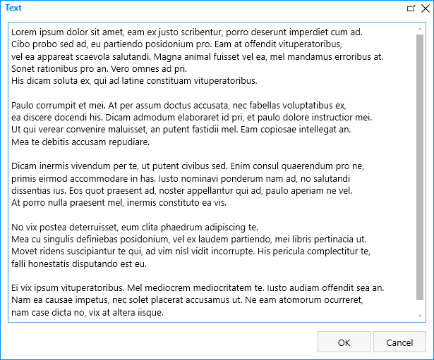
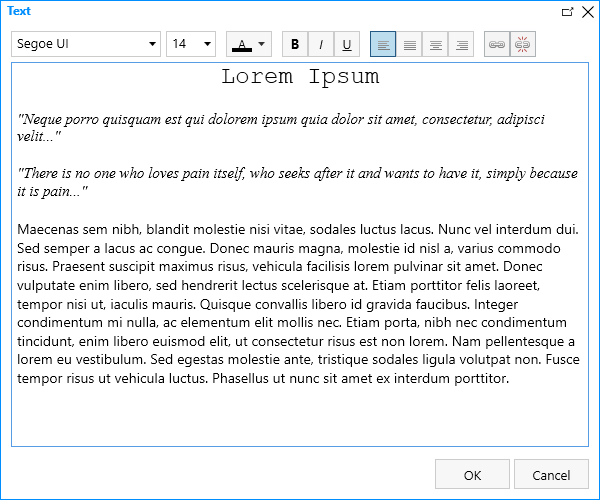
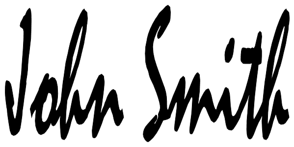

Controls
==================================================

General Info
-------------------------------------------------------------
Controls are elements designed to give you more control over your forms. They allow you to customize the look of the form and add interactivity to it. 
Controls aren't fields as they do not store information, though some controls rely on user input.

Plain Text
-------------------------------------------------------------
Plain Text control is used to add text to your form, for information that you want to convey to the user. 
Even though it's a plain text control, you can still format the text and apply styles to it.

Plain Text properties
~~~~~~~~~~~~~~~~~~~~~~~~~~~~~~~~~~~~~~~~~~~~~~~~~~
Every Plain Text control has following settings:

SETTINGS

.. list-table::
    :widths: 10 40

    *   - InternalName
        - Setting utilized by many elements. InternalName is similar to ID, it's a unique identifier for the element.

LAYOUT

.. list-table::
    :widths: 10 40

    *   - Type
        - Here you can select the type of the text you are entering - either Text or Header 1, Header 2, or Header 3.
    *   - Text
        - Allows you to type in or copy in the exact text you want to display on the form.
    *   - Color
        - Allows you to set text's color.
    *   - CSS Class
        - Give CSS Class to the element, in order to apply JavaScript or CSS Style to it. Can give multiple classes separated by spaces to one element.
    *   - Style
        - Allows you to give specific element certain style. No need to use selectors, simply add CSS rules to this setting.

Rich Text
-------------------------------------------------------------
Rich Text control is also used to add text to your form, just like Plain Text control. 
Unlike Plain Text control, Rich Text control comes with an editor which allows you to style your text without relying on CSS.

Rich Text properties
~~~~~~~~~~~~~~~~~~~~~~~~~~~~~~~~~~~~~~~~~~~~~~~~~~
Every Plain Text control has following settings:

SETTINGS

.. list-table::
    :widths: 10 40
        
    *   - InternalName
        - Setting utilized by many elements. InternalName is similar to ID, it's a unique identifier for the element.

LAYOUT

.. list-table::
    :widths: 10 40

    *   - Text
        - Allows you to type in or copy in the exact text you want to display on the form. When editing, opens up an editor screen in Designer.
    *   - CSS Class
        - Allows you to give CSS Class to the element, in order to apply JavaScript or CSS Style to it. Can give multiple classes separated by spaces to one element.
    *   - Style
        - Allows you to give specific element certain style. No need to use selectors, simply add CSS rules to this setting.

Image
-------------------------------------------------------------
Image control allows you to add images to your forms. Image can either be used as decoration or as a link.

Image properties
~~~~~~~~~~~~~~~~~~~~~~~~~~~~~~~~~~~~~~~~~~~~~~~~~~
Every Image control has following settings:

SETTINGS

.. list-table::
    :widths: 10 40
        
    *   - InternalName
        - Setting utilized by many elements. InternalName is similar to ID, it's a unique identifier for the element.

IMAGE

.. list-table::
    :widths: 10 40

    *   - Source
        - Specify the URL of an image here.
    *   - Height
        - Set the Height of the image.
    *   - Width
        - Set the Width of the image.
    *   - Alt
        - Specify an alternate text for an image here.
    *   - CSS Class
        - Allows you to give CSS Class to the element, in order to apply JavaScript or CSS Style to it. Can give multiple classes separated by spaces to one element.
    *   - Style
        - Allows you to give specific element certain style. No need to use selectors, simply add CSS rules to this setting.

HYPERLINK

.. list-table::
    :widths: 10 40

    *   - Href
        - Specify the URL of the page clicking the image sends user to. Leave blank if not needed.
    *   - Target
        - Specify where to open the linked document. _blank will open in a new tab.
    *   - OnClick
        - Add JavaScript to execute when image is clicked. If no link is used, add event.preventDefault(); prior to your JS.

Hyperlink
-------------------------------------------------------------
Hyperlink control allows you to add hyperlinks to your forms. Can be used to redirect users to different page or execute JavaScript on click.

.. image:: ../images/designer/controls/Hyperlink.png
   :alt: Hyperlink

Hyperlink properties
~~~~~~~~~~~~~~~~~~~~~~~~~~~~~~~~~~~~~~~~~~~~~~~~~~
Every Hyperlink control has following settings:

SETTINGS

.. list-table::
    :widths: 10 40
        
    *   - InternalName
        - Setting utilized by many elements. InternalName is similar to ID, it's a unique identifier for the element.
    *   - Href
        - Specify the URL of the page clicking the link sends user to. Leave blank if not needed.
    *   - Target
        - Specify where to open the linked document. _blank will open in a new tab.
    *   - OnClick
        - Add JavaScript to execute when link is clicked. If no link is used, add event.preventDefault(); prior to your JS.

LAYOUT

.. list-table::
    :widths: 10 40

    *   - Text
        - Allows you to type in or copy in the exact text the link will display on the form.
    *   - CSS Class
        - Allows you to give CSS Class to the element, in order to apply JavaScript or CSS Style to it. Can give multiple classes separated by spaces to one element.
    *   - Style
        - Allows you to give specific element certain style. No need to use selectors, simply add CSS rules to this setting.

HTML
-------------------------------------------------------------
HTML control allows you to add absolutely any HTML code to your forms. Can be used for variety of reasons, including loading of JavaScript files, creating hidden fields, etc.

HTML properties
~~~~~~~~~~~~~~~~~~~~~~~~~~~~~~~~~~~~~~~~~~~~~~~~~~
Every HTML control has following settings:

LAYOUT

.. list-table::
    :widths: 10 40

    *   - Content
        - Specify HTML contents here.

Ink Sketch
-------------------------------------------------------------
Ink Sketch control behaves more similarly to a field. It allows users to draw or leave their input by holding down mouse key and dragging the mouse across the control.
Can be used for signatures, drawings, marking details over a background image, etc.

The data is stored in the session state, once the browser is closed, it is purged. The data is also sent on Form submission using Microsoft Flow, like other fields' data.

Ink Sketch properties
~~~~~~~~~~~~~~~~~~~~~~~~~~~~~~~~~~~~~~~~~~~~~~~~~~
Every Ink Sketch control has following settings:

SETTINGS

.. list-table::
    :widths: 10 40
        
    *   - InternalName
        - Setting utilized by many elements. InternalName is similar to ID, it's a unique identifier for the element.

LAYOUT

.. list-table::
    :widths: 10 40

    *   - Readonly
        - If True, prevents users from being able to change content manually.
    *   - Height
        - Set the Height of the control.
    *   - Width
        - Set the Width of the control.
    *   - Ink Color
        - Sets the color of drawing done by the user.
    *   - CSS Class
        - Allows you to give CSS Class to the element, in order to apply JavaScript or CSS Style to it. Can give multiple classes separated by spaces to one element.
    *   - Style
        - Allows you to give specific element certain style. No need to use selectors, simply add CSS rules to this setting.

Button
-------------------------------------------------------------
Button control allows you to add buttons to your forms. Can be used to execute JavaScript on click.

Bootstrap classes can be used to give different buttons unique look.

.. image:: ../images/designer/controls/Buttons.png
   :alt: Buttons

Button properties
~~~~~~~~~~~~~~~~~~~~~~~~~~~~~~~~~~~~~~~~~~~~~~~~~~
Every Button control has following settings:

SETTINGS

.. list-table::
    :widths: 10 40
        
    *   - InternalName
        - Setting utilized by many elements. InternalName is similar to ID, it's a unique identifier for the element.
    *   - OnClick
        - Add JavaScript to execute when button is clicked.

LAYOUT

.. list-table::
    :widths: 10 40

    *   - Text
        - Allows you to type in or copy in the exact text the button will display on the form.
    *   - Width
        - Set the Width of the button.
    *   - CSS Class
        - Allows you to give CSS Class to the element, in order to apply JavaScript or CSS Style to it. Can give multiple classes separated by spaces to one element.
    *   - Style
        - Allows you to give specific element certain style. No need to use selectors, simply add CSS rules to this setting.

Submit
-------------------------------------------------------------
Submit control allows you to add submit button to your forms. 
It's actually just a button control which already includes JavaScript necessary to save and submit the Form on click, 
but you can also add your custom code or customize the Submit control just like any other button.

.. image:: ../images/designer/controls/Submit.png
   :alt: Submit