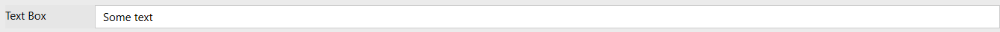
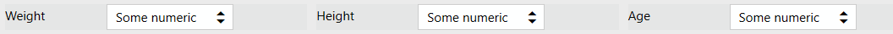
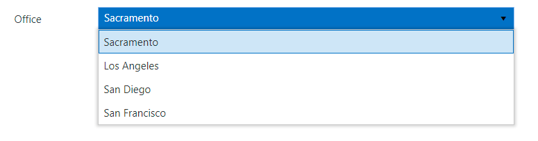
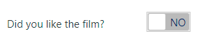
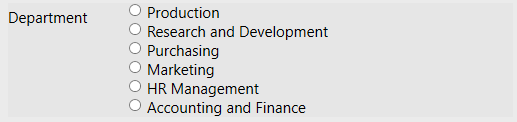
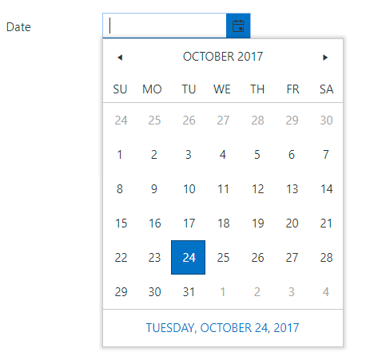
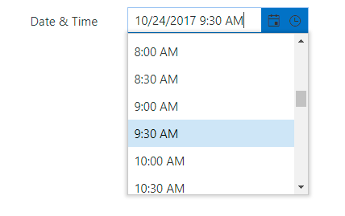
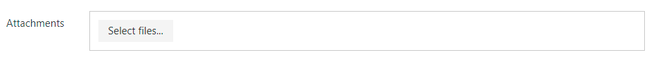

Fields
==================================================

.. contents:: Contents:
 :local:
 :depth: 1

General Info
-------------------------------------------------------------
Fields are primary input elements on the Form. 
Fields are being filled by the user and store their data in user's session storage and once the form is submitter, their contents are handled by Microsoft Flow.

Basic properties
~~~~~~~~~~~~~~~~~~~~~~~~~~~~~~~~~~~~~~~~~~~~~~~~~~
Most fields have following settings:

SETTINGS

.. list-table::
    :widths: 10 40

    *   - InternalName
        - Setting utilized by many elements. InternalName is similar to ID, it's a unique identifier for the element.
    *   - Required
        - Select if the field is required to submit the form or not.
    *   - Orientation
        - Select if the title is displayed on the left from field or on top of it, to the left. Might automatically switch if not enough space.
    *   - CSS Class
        - Give CSS Class to the element, in order to apply JavaScript or CSS Style to it. Can give multiple classes separated by spaces to one element.
    *   - Style
        - Allows you to give specific element certain style. No need to use selectors, simply add CSS rules to this setting.

TITLE

.. list-table::
    :widths: 10 40

    *   - Text
        - Select the displayed title for the field.
    *   - Visible
        - Select if the title is visible or not.
    *   - Width
        - Select the width of the title.
    *   - FontSize
        - Select font size of the title.
    *   - FontColor
        - Select font color of the title. Can be either selected or manually entered.
    *   - FontStyle
        - Select if the title is in italics or not.
    *   - FontWeight
        - Select if the title is bold or not.
    *   - Wrap
        - Select if the title will wrap if it has not enough space or not.

CONTROL

.. list-table::
    :widths: 10 40

    *   - Width
        - Allows you to set the width of the input field manually. Only takes number in pixels, no additional symbols required.
    *   - Placeholder
        - Allows you to set placeholder value for the text input. Can be used as an example for the users.
    *   - FontSize
        - Select font size for the input.
    *   - FontColor
        - Select font color for the input. Can be either selected or manually entered.
    *   - FontStyle
        - Select if the input is in italics or not.
    *   - FontWeight
        - Select if the input is bold or not.

TextBox
-------------------------------------------------------------
TextBox is the basic text input field. It doesn't support multiple lines of text and doesn't include an editor, but it's well-suited for short and simple inputs.

Numeric
-------------------------------------------------------------
Numeric is the basic number input field.

MultilineTextBox
-------------------------------------------------------------
Advanced text input, allows input of multiple lines and includes basic text editor.

.. image:: ../images/designer/fields/MultilineTextBox.png
   :alt: MultilineTextBox

DropDown
-------------------------------------------------------------
DropDown field gives user a choice which is displayed in a dropdown menu.

DropDown unique properties
~~~~~~~~~~~~~~~~~~~~~~~~~~~~~~~~~~~~~~~~~~~~~~~~~~
DropDown field has the following unique settings:

CONTROL

.. list-table::
    :widths: 10 40

    *   - Items
        - Specify items users can choose from.
    *   - MultiChoice
        - Select if user can choose more than one item from dropdown or not.

Toggle
-------------------------------------------------------------
Toggle field gives user a choice between Yes or No. By default has False value.

Toggle unique properties
~~~~~~~~~~~~~~~~~~~~~~~~~~~~~~~~~~~~~~~~~~~~~~~~~~
Toggle field has the following unique settings:

CONTROL

.. list-table::
    :widths: 10 40

    *   - OnLabel
        - Select displayed text for the True value.
    *   - OffLabel
        - Select displayed text for the False value.

Checkboxes
-------------------------------------------------------------
Checkboxes field gives user a choice which is presented as a number of checkboxes.

.. image:: ../images/designer/fields/Checkboxes.png
   :alt: Checkboxes

Checkboxes unique properties
~~~~~~~~~~~~~~~~~~~~~~~~~~~~~~~~~~~~~~~~~~~~~~~~~~
Checkboxes field has the following unique settings:

CONTROL

.. list-table::
    :widths: 10 40

    *   - Items
        - Specify items users can choose from.
    *   - Columns
        - Number of columns items are grouped by.

Radios
-------------------------------------------------------------
Radios field gives user a choice which is presented as a number of radio buttons. Unlike checkboxes, only one option can be selected.

Radios unique properties
~~~~~~~~~~~~~~~~~~~~~~~~~~~~~~~~~~~~~~~~~~~~~~~~~~
Radios field has the following unique settings:

CONTROL

.. list-table::
    :widths: 10 40

    *   - Items
        - Specify items users can choose from.
    *   - Columns
        - Number of columns items are grouped by.

Date
-------------------------------------------------------------
Date field allows users to input date.

DateTime
-------------------------------------------------------------
DateTime field allows users to input date and time.

Attachments
-------------------------------------------------------------
Attachments field allows users to attach files to the form. It's possible to do it by either uploading files manually or dragging and dropping them into the field.
Possible to drag and drop multiple files at once.

Attachments unique properties
~~~~~~~~~~~~~~~~~~~~~~~~~~~~~~~~~~~~~~~~~~~~~~~~~~
Attachments field has the following unique settings:

SETTINGS

.. list-table::
    :widths: 10 40

    *   - MaxSize (Kb)
        - Maximum file size each uploaded file can be. Maximum file size is 10240, but you can restrict it down.
    *   - AllowedExtensions
        - Choose what files should be allowed to upload. Extensions should have a dot in front of them, can be separated by a comma, a semicolon or placed on different lines. If empty, all extensions are allowed.