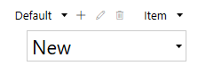
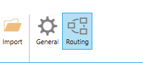
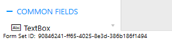

Form Sets
=========================================

.. contents:: Contents:
 :local:
 :depth: 1

General Info
-------------------------------------------------------------
Form Sets allow you to design additional forms for SharePoint List or Library. 

By default, each List only has three forms - New, Edit and Display. 
Each additional Form Set allows you to add three more forms - also New, Edit and Display, but a Form Set doesn't have to contain all three forms, it can be just one or two.

You can have as many Form Sets as necessary. You can also either manually redirect users to a Form Set with JavaScript 
or automatically redirect users from certain SharePoint groups to a specific Form Set.

You can select currently active Form Set in an upper right corner, in the drop-down.

Default Form Set is what all users see if they are not redirected to another Form Set straight way.

You can add new Form Set by clicking **+** sign next to the currently selected Form Set. Clicking Pen Icon allows you to edit properties of the currently selected Form Set.
Trash bin icon allows you to delete the Form Set.

After creating a Form Set, do not forget to save every form you plan to use or it might be missing.

Automatic routing based on SharePoint group membership
-------------------------------------------------------------
When you create a Form Set, straight away, you can configure automatic routing for the members of certain groups:

.. image:: ../images/designer/form-sets/2-FormSetsConfig.png
   :alt: Form Sets Configuration

* Name - the name of the Form Set, can be anything you want, just makes it easier to find among all the Form Sets.
* Order - determines the order in which to open Form Sets if conditions are met. The lower the Order value, the higher the priority for Form Set to open.
* Open forms when a user belongs... - select all groups user must belong to in order to be redirected. **Note!** Must select something in order for redirection to work.
* Excluding the selected groups - will not redirect the user that belongs to the previously picked groups, if the user also belongs to one of the groups selected here.

.. _designer-customrouting:

Custom routing
-------------------------------------------------------------
You are not limited to checking current user's group membership, using custom routing you can use any logic to redirect users to specific form.

Witch custom routing, you can check current item's fields, for example ID or Author fields, you can also check user's attributes, such as role or department,
or you can get any other available information from SharePoint. Based on this information, you can redirect user to a different Form Set or URL.

Custom routing always takes priority over group routing. So, if your custom code returns Id of a form set, 
users will get redirected to the corresponding form all the time, even if they do belong to certain groups.

To add custom routing conditions, click *Routing* button:

Custom routing uses JavaScript for conditions and redirection, as well as SharePoint Patterns & Practices (PnP) |JavaScript Core Library|.

This library contains a fluent API for working with the full SharePoint REST API, allowing you to easily get any necessary information from SharePoint.

.. |JavaScript Core Library| raw:: html

   <a href="https://sharepoint.github.io/PnP-JS-Core/" target="_blank">JavaScript Core Library</a>

Some predefined variables accessible from your code:

    -   **webUrl** - URL of the current site
    -   **listId** - ID of the current list
    -   **itemId** - ID of the current item
    
    -   **pnp** - pnp JS library instance
    -   **web** - current Web from pnp 
    -   **list** - current List from pnp
    -   **item** - current Item from pnp or null for a New form

The code in custom routing must return either server-relative or absolute URL, or ID of a form set. It can also return Promise that is resolved with URL or form set ID. 
The URL or the ID will be used to redirect user either to specific Form Set or address.

Form Set ID can be found in the lower left corner of the designer:

If the code returns nothing or throws an error, default routing is applied.

**Important!** Custom routing is configured for all Forms and Form Sets of the current Content Type. Each Content Type has its own custom routing configuration.

Examples
**************
Redirect to a certain form set if 'AssignedTo' field equals the current user:

.. code-block:: javascript

    //check if Item already exists, will return true for Edit and Display Form
    if (item) {
        //first, get the current user
        var user;
        // return Promise
        return web.currentUser.get()
            .then(function(u) {
                user = u;
                return item.get();
            })
            .then(function(item) {
                //then compare User ID to ID of the user in the AssignedTo field
                if (user.Id == item.AssignedToId) {
                    return '31fb1f41-63f3-48ff-a1c2-18b4e7f7c3e7';
                }
            });
    }

Redirect to a certain form set if 'Status' field equals 'Solved':

.. code-block:: javascript

    //check if Item already exists, will return true for Edit and Display Form
    if (item) {
        // return Promise
        return item.get()
            .then(function (item) {
                //if Item's Status is Solved, redirect
                if (item.Status == 'Solved') {
                    return '31fb1f41-63f3-48ff-a1c2-18b4e7f7c3e7'
                }
            });
    }