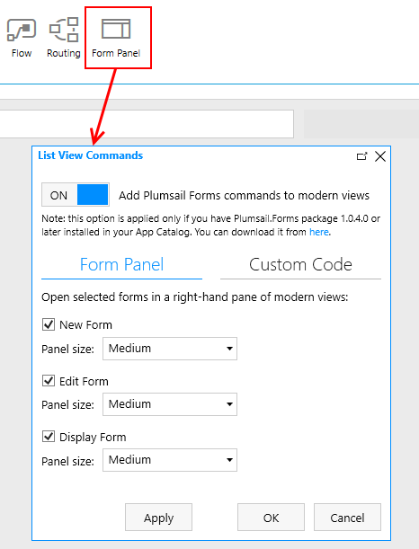

SharePoint Form Panel
=========================================

.. contents:: Contents:
 :local:
 :depth: 1

General Info
-------------------------------------------------------------
SharePoint Form Panel allows you to open SharePoint forms in a panel, similar to default SharePoint forms.

*In order to use this functionality, please, make sure to* :ref:`update the package <install-app-package>` *in the App Catalog to v.1.0.4 or higher.*

Form Panel preserves full functionality of our custom SharePoint fields - including :doc:`routing </designer/form-sets>`.

It's configured in the designer, in the new Form Panel section:

Here, you can select which forms you want to be opened in the panel, as well as the size of the panel. 
After first configuration, please, **re-save** the forms that you want to open in the panel.

**Important!** There is a slight delay between the time when a user opens the list and when the script loads completely for panel forms, so if the users open a form too quickly, 
then they will be redirected to a default full-screen form instead of a panel.

Advanced
-------------------------------------------------------------
Inside Form Panel configuration there is the Custom Code tab, where you can add JavaScript which will execute when the script loads in the List View.

For example, this code will allow you to hide Properties section in Details panel, so user will need to open an actual form to edit them:

.. code-block:: javascript

        var styleEl = document.createElement('style');
        document.head.appendChild(styleEl);
        var styleSheet = styleEl.sheet;
        styleSheet.insertRule('.InfoPaneSection--properties{display: none;}', 0);
