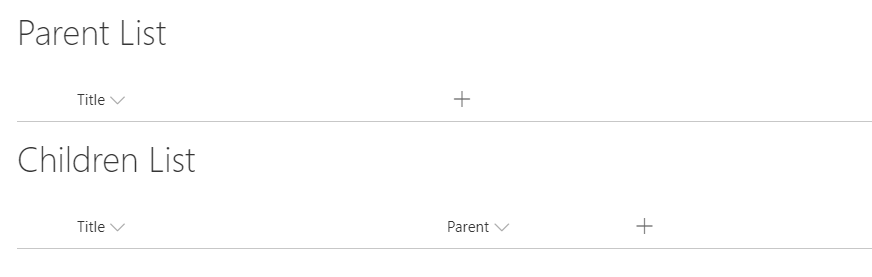
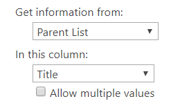
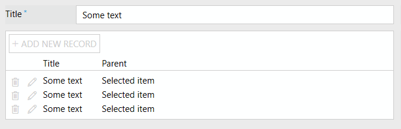
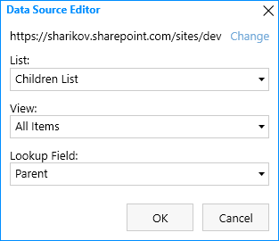
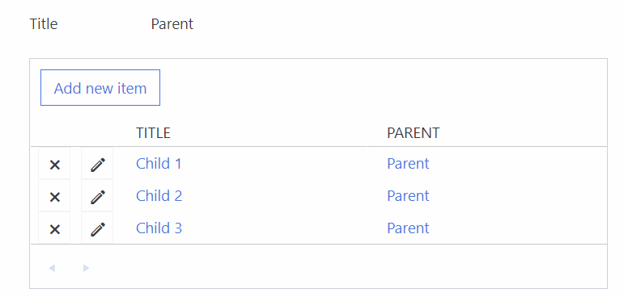

Create and bind Child elements on Modern SharePoint Forms
============================================================

.. contents:: Contents:
 :local:
 :depth: 1

Description
--------------------------------------------------
This article will describe how you can use :ref:`designer-listorlibrary` control from the form to create Child elements and bind them to Parent.

What this essentially means, you can add new items or documents from the form straight into related list or library, 
and automatically attach them to current item with a lookup.

With **List or Library** control this is very easy to do, just follow the steps described in this article.

Bind children to parent
--------------------------------------------------
First, create Lists that you want to use as Parent List and Children List. You can use Lists or Document Libraries for this.

|

In the Children List/Library create a Lookup column and select *Get information from:* Parent List. You can choose any field to display such Title or ID.

|

Design forms for both Parent and Children Lists, including New, Edit and Display forms. Document Libraries only need Edit and Display forms.
   
Do not add the lookup to the Child form, as you don't want users to change it manually.

|

Finally, add List or Library control to the Parent forms. In SETTINGS → DataSource, select *List:* Children List and *Lookup Field*: Parent lookup.

|

This will ensure that when you open Parent Edit or Display Form, you will only see connected items in the List or Library control.

Connecting Child to Parent happens automatically, in Edit and Display forms it happens straight away, but in New Form, 
you must first save Parent and then added items will be tied to Parent. All this happens automatically without any additional configuration.

Uploaded documents also get connected to Parent via Lookup, so this functionality is the same for both Lists and Libraries.

|