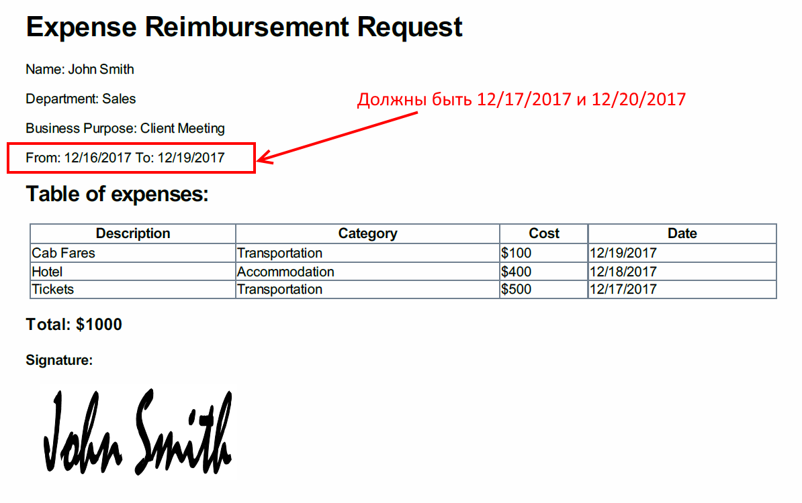

Format Data Table in an HTML-template before converting into PDF
=================================================================

.. contents:: Contents:
 :local:
 :depth: 1

Description
--------------------------------------------------
This article will describe how you can convert :ref:`designer-datatable` into HTML template with |Plumsail Actions|.

It's an additional example of using Plumsail Forms data with Plumsail Actions, so it can be used like described in :doc:`the previous article </how-to/data-table-flow>`.

In here, we will also show you how you can format data inside Data Table with HTML-template for columns such as date.

Setting up the form
--------------------------------------------------
We will use the same form that we used in the previous article - :ref:`data-table-form`.

It's still the same Expense Reimbursement Form, we just need to add Date column to our Expenses table and set its type to Date:

.. image:: ../images/how-to/data-table-convert-html/1_Add_Date.png
   :alt: Add Date column to Expenses table

Microsoft Flow using HTML template functionality
--------------------------------------------------
This will show you how you can set up MS Flow with DataTable without converting it to HTML table first.

Read more about adding Plumsail Actions connector in this section - :ref:`plumsail-actions-flow`.

Once the connector is set up, search for HTML Template and select *Plumsail Documents - Create HTML from template*:

.. image:: ../images/how-to/data-table-flow/4_Plumsail_Documents_Search.png
   :alt: Search for HTML Template and select Plumsail Documents - Create HTML from template

| 

Once the action is added, we need to fill in both *Source HTML* and *Template Data*. 

Since *Source HTML* uses *Template Data* quite extensively, it's best to first define *Template Data*.

*Template Data* needs to be composed as a JavaScript object where we include all our data, in our case - just the form.

First, I'll create very basic structure for our object:

.. code-block:: javascript

    {
        "Form": INSERT FORM HERE
    }

Now, we can insert Form Body inside "Form":

.. image:: ../images/how-to/data-table-convert-html/3_HTML_Template_Form.png
   :alt: HTML Template data with Form

| 

And that's it! We don't need anything else in the template as we can access all our data from the submitted form.

Now we can write Source HTML and use our Template data to populate it. We can also include style with it by either linking HTML to CSS file or just include style tag inside Source HTML. 
Even JavaScript can be included and it will be executed unless it's asynchronous.

Here's an HTML that I've used:

.. code-block:: HTML

    <!doctype html>
    <html>
    <head>
        <meta charset="utf-8">
        <title>Expense Reimbursement Request</title>
        
    </head>
    <body>
        <h1>Expense Reimbursement Request</h1>
        
Name: {{Form.Name}}

        
Department: {{Form.Department}}

        
Business Purpose: {{Form.Purpose}}

        
From: {{Form.From:d}} To: {{Form.To:d}} 

        <h2>Table of expenses:</h2>
    <table>
        <tr>
            <th>Description</th>
            <th>Category</th> 
            <th>Cost</th>
            <th>Date</th>
        </tr>
        {{#each Form.ExpensesTable}}
        <tr>
            <td>{{Description}}</td>
            <td>{{Category}}</td> 
            <td>${{Cost}}</td>
            <td>{{Date:d}}</td>
        </tr>
        {{/each}}
    </table>
        <h3>Total: {{Form.Total}}</h3>
        

            <h4>Signature:</h4>
            
        

    </body>
    </html>

As you can see, there are several interesting things I've used here. First of all, I've formatted the dates like this:

.. code-block:: HTML

    
From: {{Form.From:d}} To: {{Form.To:d}} 

Adding **:d** after date will automatically convert any date to American Short Date format *MM/dd/yyyy*.

Plumsail Actions HTML Template engine is based on |mustache#| and provides the same formatting based on |String.Format|.

Another thing of interest is iteration through each item in ExpensesTable:

.. code-block:: HTML

        {{#each Form.ExpensesTable}}
        <tr>
            <td>{{Description}}</td>
            <td>{{Category}}</td> 
            <td>${{Cost}}</td>
            <td>{{Date:d}}</td>
        </tr>
        {{/each}}

Since ExpensesTable is passed as an array of objects, it's really easy to do, and then I can also access various columns inside {{#each}}{{/each}}.

As you can see, I've formatted the dates and added a dollar sign before cost, to make result more readable and easier to understand.

*   **Note:** *While formatting with String.Format is very easy, it happens on the server and the server automatically converts everything to en-US culture*.
    
    *If you want to format your values to a different culture, you can either do it ouside HTML Template engine or use JavaScript which is also executed when HTML template is created*.

.. |mustache#| raw:: html

   <a href="https://github.com/jehugaleahsa/mustache-sharp" target="_blank">mustache#</a>

.. |String.Format| raw:: html

   <a href="https://msdn.microsoft.com/en-us/library/system.string.format.aspx" target="_blank">String.Format</a>

.. |Plumsail Actions| raw:: html

   <a href="https://plumsail.com/actions/" target="_blank">Plumsail Actions</a>

Now we can convert result HTML into PDF. Search for Plumsail Documents and select *Plumsail Documents - Convert HTML to PDF*:

.. image:: ../images/how-to/data-table-flow/6_Plumsail_Documents_Search2.png
   :alt: Search for Plumsail Documents and select Plumsail Documents - Convert HTML to PDF

| 

Place Result HTML from the last action inside Source HTML field:

.. image:: ../images/how-to/data-table-flow/7_Plumsail_Convert_HTML_to_PDF.png
   :alt: Plumsail Documents - Convert HTML to PDF

| 

Read more on how to receive this PDF via email in :ref:`email-pdf-attachment` section.

And here's PDF that I receive from Flow:

| 

Fixing time zones for Dates
-------------------------------
One issue that you may face with the dates in Flow is time zone offset. 

Dates in Microsoft Flow are in Universal Time (aka, UTC or GMT) by default, but Plumsail Forms dates are in your local time which could lead to unexpected results.

These differences can be resolved by adjusting dates before submission with JavaScript in **fd.beforeSave()** event.

In our case, we can make sure that dates are correct with the following code, including dates in our expenses table:

.. code-block:: javascript

    fd.beforeSave(function(data) {
        //convert From field to appropriate 12:00 AM Time UTC:
        data.From = new Date(data.From.getTime() 
            - data.From.getTimezoneOffset() * 60000);
            
        //convert To field to appropriate 12:00 AM Time UTC:
        data.To = new Date(data.To.getTime() 
            - data.To.getTimezoneOffset() * 60000);

        //convert Date column to appropriate 12:00 AM Time UTC:
        for (var i = 0; i < data.ExpensesTable.length; i++){
		    var date = data.ExpensesTable[i].Date;
		    data.ExpensesTable[i].Date = new Date(date.getTime() 
			    - date.getTimezoneOffset() * 60000);
	}
    });