Convert form with DataTable into PDF and send for approval
===========================================================

Description
--------------------------------------------------

With recently added :ref:`designer-datatable` control, we can design a more complex form and then submit it to Flow.

In this example, we will design an Expense Reimbursement Form, which will include DataTable to list all the expenses,
as well as Ink Sketch controls to get signatures from the user and his supervisor.

Design a form
--------------------------------------------------
First, we will design a form, which will include all the necessary information from the employee, such as name, ID, Department, and the purpose behind the expenses.
We will also include two date fields From and To, which will include time period during which the expenses took place.

Next, our form will have DataTable to store all the expenses and will include Description, Category and Cost.

After the table, we will have Total field which will automatically calculate and display Total amount of expenses.

Finally, the form will include a signature pad for the employee to sign the form.

Here's our result:

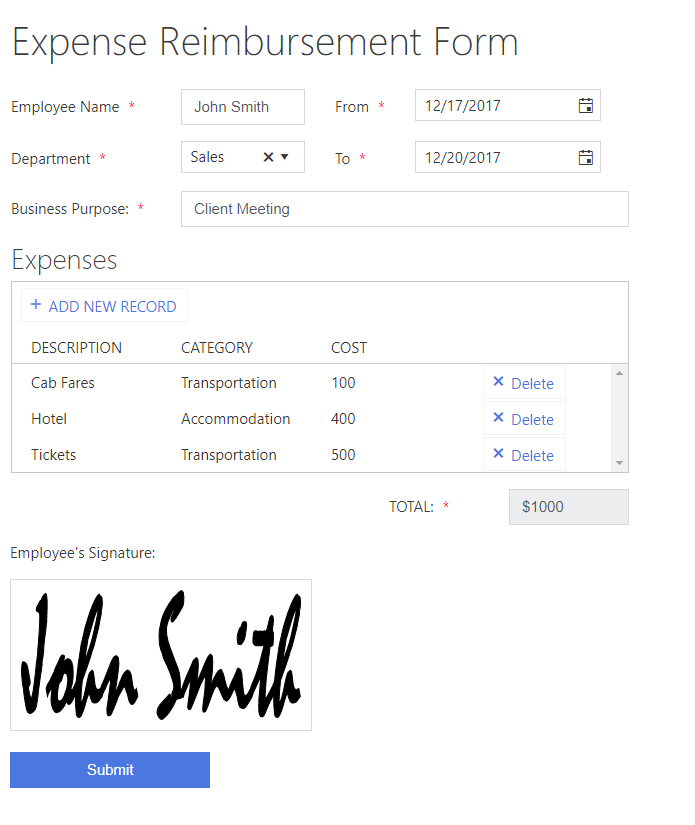

|

With this form we can compose a PDF file and send it for the approval. 

But first, let's work on our form's logic to make sure that all fields are set correctly on our form.

.. _data-table-form:

Form's Logic
--------------------------------------------------
So, what JavaScript logic do we need? First, we need to make sure that all fields are set correctly and that the form is signed.

First we set all fields as mandatory, as none of them are optional. This can be done in the designer by selecting a field and changing SETTINGS  → Required to True:

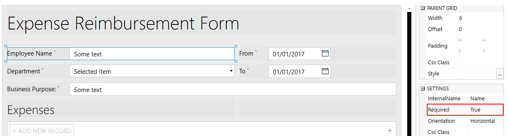

|

We can also do the same with DataTable columns by selecting the column and also changing SETTINGS  →  Required to True:

.. image:: ../images/how-to/data-table-flow/1_Column_Required.png
   :alt: Description column is set as Required

|

Now that the fields and columns are set as required, we can work on Form validators to make sure that the form is signed and that the fields have correct input.

Let's make sure that the Date "To" is greater or the same as Date "From":

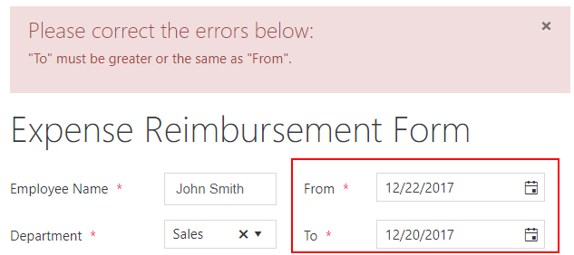

|

We can also have another validator to make sure that the form is signed:
    
.. image:: ../images/how-to/data-table-flow/1_Signature_Error.png
   :alt: Form needs to be signed before submission

|  

Now, let's add both these validators to our form with this code:

.. code-block:: javascript
    
    //once the form is rendered:
    fd.rendered(function(){
        fd.validators.push({
            name: 'DateValidator',
            error: '"To" must be greater or the same as "From"',
            validate: function(value) {
                if (fd.field('From').value >= fd.field('To').value)
                    return false;
                    
                return true;
            }
        },
        {
            name: 'SignatureValidator',
            error: 'Please, sign the form before submitting',
            validate: function(value) {
                if (fd.control('Signature').value)
                    return true;
                    
                return false;
            }
        });
    });

Final piece of code that we need to implement is an automatic calculation of Total field. 

Each time a user changes values in Cost column of Expenses DataTable, Total needs to be recalculated. 

The field itself will be set to disabled state, so the user won't be able to change it directly, only by adding Cost to the records in Expenses DataTable:

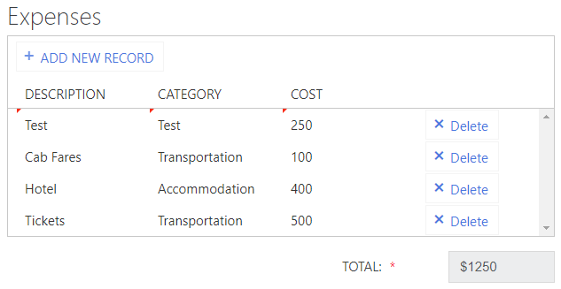

| 

This can be done with JavaScript, which will add inside fd.rendered() event function after adding our validators:

.. code-block:: javascript

    fd.rendered(function(){
        //... validators are added here
        
        fd.field("Total").disabled = true;

        fd.control('ExpensesTable').$on('change',
            function(value) {
                var total = 0;
                for (var i = 0; i < value.length; i++){
                    total += parseInt(value[i].Cost);
                }
                //Total field is a Text field, so I can add a dollar symbol to it:
                fd.field("Total").value = '$' + total;
        });
    });

Now that we are done with Form configuration, it's time to set up our Flow.

.. _flow-html-table:

Microsoft Flow using HTML Table
--------------------------------------------------
In this example we will first create HTML Template from the submitted data and then transform HTML into PDF and send it via Email.

We will use |Plumsail Actions| to create HTML with template which would use submitted data, then convert this HTML into PDF.

If you haven't read our introduction to using MS Flow with Plumsail Forms, you can find information on how to add our custom connector :doc:`here </microsoftFlow>`.

You can also find information about how to subscribe to Form submission in this article - :ref:`creating-flow`.

Once you set up the basics of the Flow for our Form, including Form submission trigger and JSON Parse action, we can start working on our HTML.

| 

First, let's convert our DataTable into HTML Table. Search for HTML Table and select *Data Operations - Create HTML table* action:

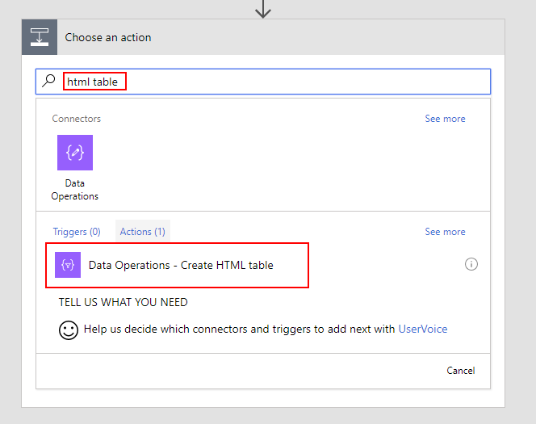

| 

Here, we pass ExpensesTable in From field, I also open Advanced options and select *Include headers* - Yes:

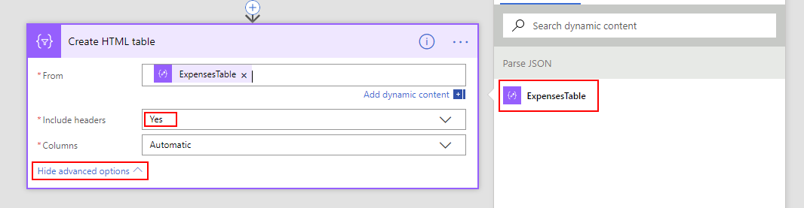

| 

Plumsail Actions in MS Flow for DataTable
--------------------------------------------------

Now, we will use Plumsail Actions connector, which you can read about setting up |Plumsail Actions connector|. 

You can either create Custom connector or use MS Flow Premium connector, 
but you will need to have an API key from |Plumsail Account| in both cases.

.. |Plumsail Account| raw:: html

   <a href="https://auth.plumsail.com/account/login" target="_blank">Plumsail Account</a>

.. |Plumsail Actions connector| raw:: html

   <a href="https://plumsail.com/docs/actions/v1.x/getting-started/use-from-flow.html" target="_blank">here</a>

Once the connector is set up, search for HTML Template and select *Plumsail Documents - Create HTML from template*:

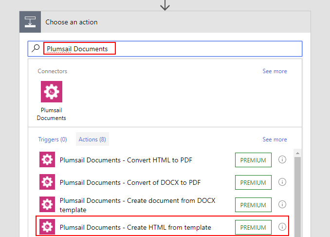

| 

Once the action is added, we need to fill in both *Source HTML* and *Template Data*. 
Since *Source HTML* uses *Template Data* quite extensively, it's best to first define *Template Data*.

*Template Data* needs to be composed as a JavaScript object where we include all our data - original form output, our HTML table.

*Template Data* is also the place where we will format our dates to look more appealing in the end result.

First, I'll create the basic structure for our object:

.. code-block:: javascript

    {
        "Form": INSERT FORM HERE,
        "Table": INSERT HTML TABLE HERE,
        "From": CONVERT DATE HERE,
        "To": CONVERT SECOND DATE HERE
    }

Now, we can insert Form Body inside "Form" and result of HTML Table conversion inside "Table":

.. image:: ../images/how-to/data-table-flow/5_HTML_TemplateData.png
   :alt: HTML Template data with Form and Table

| 

Next, we need to convert Dates. If you go to Expression, you can select **formatDateTime()** function 
then go back to Dynamic Content and insert one of date fields as first parameter in formatDateTime(**Date Here**, ...):

.. image:: ../images/how-to/data-table-flow/5_HTML_Template_FormatDate.png
   :alt: Format date

| 

Then add format as the second parameter so it looks like this and click OK:

.. code-block:: javascript

    formatDateTime(body('Parse_JSON')?['From'], 'MM/dd/yyyy')

This is our final version of Template Data:

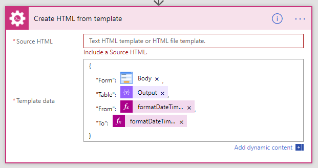

| 

Now we can write Source HTML and use our Template data to populate it. We can also include style with it by either linking HTML to CSS file or just include style tag inside Source HTML.

Here's an HTML that I've used:

.. code-block:: HTML

    <!doctype html>
    <html>
    <head>
        <meta charset="utf-8">
        <title>Expense Reimbursement Request</title>
        
    </head>
    <body>
        <h1>Expense Reimbursement Request</h1>
        
Name: {{Form.Name}}

        
Department: {{Form.Department}}

        
Business Purpose: {{Form.Purpose}}

        
From: {{From}} To: {{To}} 

        <h2>Table of expenses:</h2>
        {{Table}}
        <h3>Total: {{Form.Total}}</h3>
        

            <h4>Signature:</h4>
            
        

    </body>
    </html>

Last thing that we need to do is convert HTML into PDF. Search for Plumsail Documents and select *Plumsail Documents - Convert HTML to PDF*:

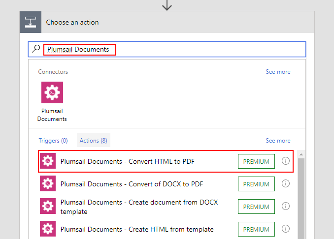

| 

Now we place Result HTML from the last action inside Source HTML field:

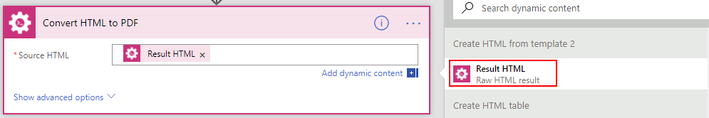

| 

.. _email-pdf-attachment:

Send an email with PDF attachment
--------------------------------------------------

We'll use Microsoft's *Office 365 Outlook - Send an email* action to send an email. Select it:

.. image:: ../images/how-to/email/10_SendAnEmail.png
   :alt: Send an email

|

Fill in the information for the email, then open Advanced options and add result PDF as an attachment:

.. image:: ../images/how-to/data-table-flow/8_Send_Email.png
   :alt: Add an attachment

|

Now, when we run the Flow, I receive an email with this PDF:

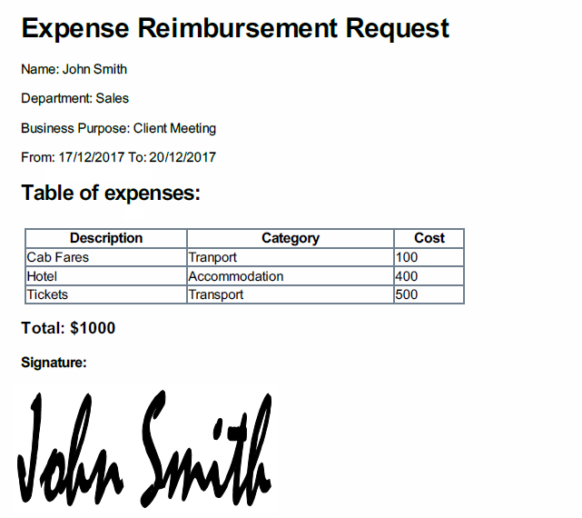

|

Summary
--------------------------------------------------
In conclusion, I just wanted to bring your attention on how easy it is to transform any Plumsail Form submitted to Flow into PDF with |Plumsail Actions|.

Just follow three easy steps - submit form to Flow and parse JSON, transform data to HTML template and transform HTML template to PDF.

You can read more about the first step in our :ref:`creating-flow` article.

Trasnforming to HTML is also an easy step with Plumsail Actions, read more about it here - |Create HTML|. 

You can even include any custom layout in HTML template, for example, your company's logo in the header of template and extra information in the footer:

.. image:: ../images/how-to/data-table-flow/10_html-and-pdf-result.png
   :alt: PDF result from HTML

|

Finally, transforming to PDF couldn't be easier and just done in one easy step, where you take output HTML and transform it directly to PDF.

It's described fully in |Create PDF| article.

.. |Plumsail Actions| raw:: html

   <a href="https://plumsail.com/actions/" target="_blank">Plumsail Actions</a>

.. |Create HTML| raw:: html

   <a href="https://plumsail.com/docs/actions/v1.x/flow/how-tos/documents/create-html-from-template.html" target="_blank">Create HTML document from template</a>

.. |Create PDF| raw:: html

   <a href="https://plumsail.com/docs/actions/v1.x/flow/how-tos/documents/create-pdf-from-html-template.html" target="_blank">Create PDF from HTML template</a>