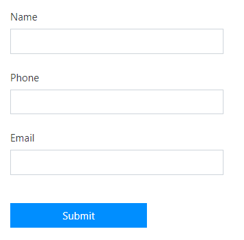
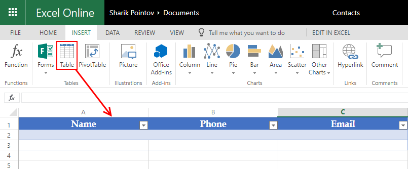
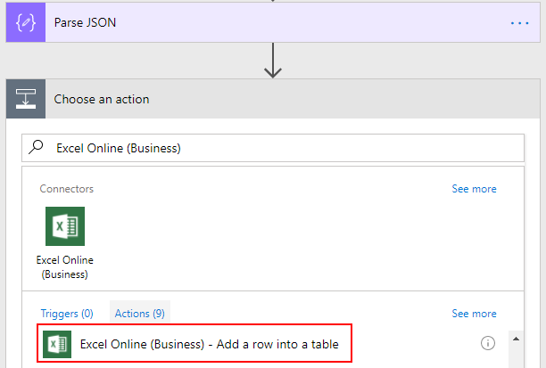
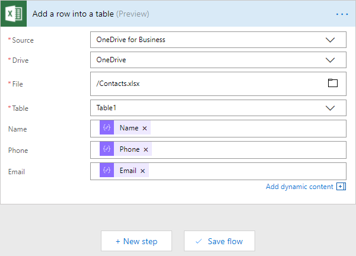
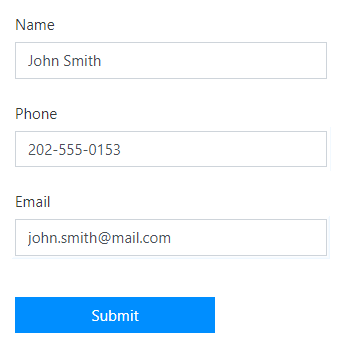

Add row to Excel Table (Office365) or Google Sheet from Public Web Form
========================================================================

.. contents:: Contents:
 :local:
 :depth: 1
 
Description
--------------------------------------------------
In this article we are going to show you how you can use MS Flow and Plumsail Forms connector in 
order to add rows to an Excel Table in Office 365, though it can also be used for any Excel file 
stored online, for example in Dropbox or Box account, or even on your own site. 

We will also show how to add rows to a Google Sheet. Without further ado, let's get started!

Excel Table
--------------------------------------------------
For both of the examples, we'll be using a very simple contact form with just three fields - Name, Phone and Email:

|pic1|

In this example, we are using *OneDrive for Business* as storage for our Excel file. When you create 
an Excel Online file in Office365, it's automatically stored there. We've created Contacts.xlsx file 
and added table to it:

|pic2|

If you are working with a regular Excel file, you might not need to add a table, but current version 
of Excel Online (Business) connector only supports adding rows to Tables, that's why it's better to 
create it first.

When you create custom Flow, follow this instruction to receive and parse data from submitted form - :ref:`creating-flow`.

After Parsing JSON, we need to add data to Excel. Search for *Excel Online (Business)* and select *Add a row into a table* action:

|pic3|

Next, we fill in all the required information about our file, the table we want to add row to, as 
well as what information we want to add - we insert data parsed from the form:

|pic4|

Once this is done, we can press Save Flow and test Flow submission with our Form:

|pic5|

And here's the result after submission:

|pic6|

.. |pic6| image:: ../images/how-to/excel-single-row/6_Result_Excel.png
   :alt: Result in Excel
