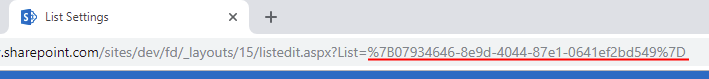

Generate a link to form
==================================================

.. contents:: Contents:
 :local:
 :depth: 1
 
Description
--------------------------------------------------
Often, it might be necessary to redirect users to a specific form. It's possible to simply open a form, copy it's link and then use JavaScript for redirection to this specific URL.
But it would also mean that the users are not redirected to a specific Form Set, if you have routing configured, since you bypass the redirection and go directly to page.

Another thing, if the user is not logged in, before reaching the form, they will be redicted to Microsoft's authentication, and in this process, 
the URL would lose its parameters, such as Item ID, preventing the form from opening correctly.

In this article, we're going to show you how you can create general URLs, which would only specify what List and what Item you want to open, 
thus allowing for routing to take place, plus avoiding the lose of parameters during authentication.

We will also show you how you can create specific URLs to the forms, including Form Sets, which will bypass Microsoft's authentication and keep all the parameters.

Universal URL
--------------------------------------------------
Universal URL will lead users not to a particular form, but will open an appropriate form for the user. It will use all the :doc:`Routing rules </designer/form-sets>` set for the List, 
so it is very useful as a generic link, for example, to send multiple users in various groups, and let Routing redirect them to the correct Form Set.

The structure of the URL is fairly simple:

.. code-block:: javascript

    var url = "https://domain.sharepoint.com/sites/sitename/subsite/_layouts/15/listform.aspx?PageType=" + pageTypeNumber + "&ListId=" + listId + "&ID=" + itemId

* **pageTypeNumber**
    -   a type of the form that you want to open: 
    -   **8** is New Form
    -   **6** is Edit Form 
    -   **4** is Display Form

* **listId** is the ID of the List or Document Library to open, which can be copied from the URL of List/Library settings page:

|pic1|

* **itemId** is the ID of the Item or Document to open.

Buidling link with JavaScript
************************************************
A link can also be built with JavaScript and can be used in variety of situations. To :doc:`redirect user after form submission</how-to/redirect-sp-save>` to the next form, or to :doc:`open form in dialog</javascript/dialog>`, for example.

Use the following code to build link while on a form:

.. code-block:: javascript

    var url = "https://domain.sharepoint.com/sites/site/_layouts/15/listform.aspx";
    //current item's Edit Form URL:
    var params = {
        PageType: 6,
        ListId: fd.spFormCtx.ListAttributes.Id,
        ID: fd.itemId
    }

    url += "?" + $.param(params);
    console.log(url);
    Dialog.open(url);

Now, you don't have to get all these values with JavaScript, some, if not all, can be prepopulated depending on your scenario.

.. _link-specific:

Specific URL
--------------------------------------------------
Specific URL will open a particular form, unlike Universal URL, so you can specify every little detail, including a Form Set.

.. important:: This URL will only work if you've :doc:`updated the app package </general/update-package>` to v.1.0.6.0 and saved form in Forms application v1.3.2 or higher

The structure of the speicific URL is this:

.. code-block:: javascript

    var url = "https://domain.sharepoint.com/sites/sitename/subsite/SitePages/PlumsailForms/ListName/ContentType/FormType.aspx?item=" + itemId + "&ct=" + contentTypeId + "&rf=" + rootFolder + "&source=" + sourceURL

* **itemId** is the ID of the Item or Document to open. This parameter is the only one that is required for Edit and Display Forms.

* **contentTypeId** is the ID of the Content Type with which the item will be saved after form submission. Optional.

* **rootFolder** is only used for New Form, and can specify folder where new Item will be created. Optional.

* **sourceURL** is the URL where the user will be redirected after the form is closed. Optional.

You can find all the forms stored in Site contents -> Site Pages/PlumsailForms in the folders with List names.

