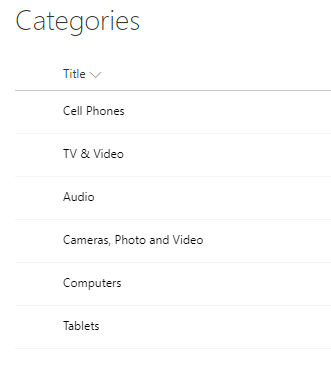
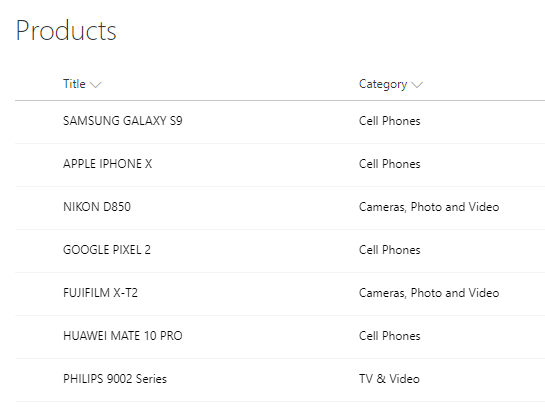
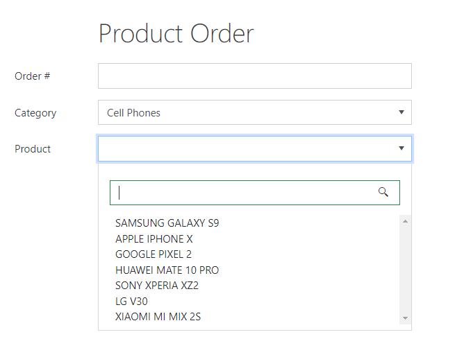
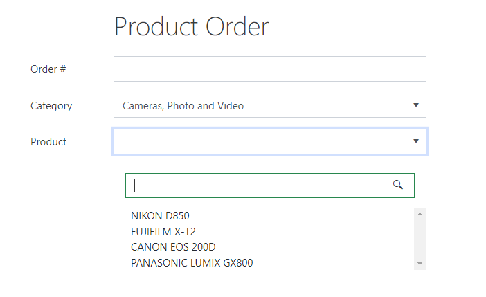

Cascading Lookups
==================================================

.. contents:: Contents:
 :local:
 :depth: 1
 
Description
--------------------------------------------------
With a little bit of JavaScript code, you can now easily configure Cascading Lookup fields. 

What does that mean? Just to be clear, I am talking about Lookup fields where choosing value in one field, limits available choice in the other field.

Example that I will show you in this list will include Categories and Products, so that the user can only see and choose Products belonging to the selected Category.

Setting up Lists
--------------------------------------------------
There is nothing difficult in setting up the Lists. Our first List - Categories, only contains Title column:

|pic1|

Second list needs to be connected to the first List, in order for filtering to work correctly. Easiest way is via Lookup. 
In our case, Products List has a Lookup to Categories List:

|pic2|

Form Configuration
--------------------------------------------------
I've created a simple Product Order form:

|pic3|

.. |pic3| image:: ../images/how-to/lookup-cascading/form.png
   :alt: Product Order form

In order for Lookups to be connected, I only need to change two things. First, I need to select Products Lookup and alter its Extra Fields property:

|pic4|

.. |pic4| image:: ../images/how-to/lookup-view/extra-fields.png
   :alt: Extra Fields

It should retrieve ID of the Category Lookup in the Products List, so we can compare it to this form's selected Category:

.. code-block:: javascript

    Category/Id

I will also need to use Expand property to get access to the Category field in the code:

|pic5|

.. |pic5| image:: ../images/how-to/lookup-view/expand.png
   :alt: Expand

Here, I just need to add Internal Name of the Lookup field, simple enough:

.. code-block:: javascript

    Category

JavaScript
--------------------------------------------------

Last but not least, we use JavaScript in order to apply filtering:

.. code-block:: javascript

    fd.spRendered(function() {
        function filterLookup(v){
            var categoryId = 0;
            if (v) {
                categoryId = isNaN(v) ? v.LookupId : v;
            }
            
            if (categoryId) {
                fd.field('Product').filter = 'Category/Id eq ' + categoryId;
                
                if (fd.field('Product').value && fd.field('Product').value.Category.Id != categoryId) {
                    fd.field('Product').value = null;
                }
            } else {
                fd.field('Product').filter = null;
            }
            
            fd.field('Product').widget.dataSource.read();
        }
        
        //filter Products when form opens
        filterLookup(fd.field('Category').value);
        
        //filter Products when Category changes
        fd.field('Category').$on('change', function(value){
            filterLookup(value);
        });
    });

Result
--------------------------------------------------
By default, all Products are available in the Products field, but if I choose Category - only products of this particular Category are available.

For example, here is Cell Phone Category:

|pic6|

And here I've selected Camera Category:

|pic7|

