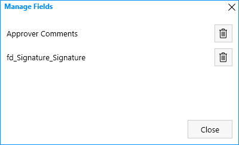
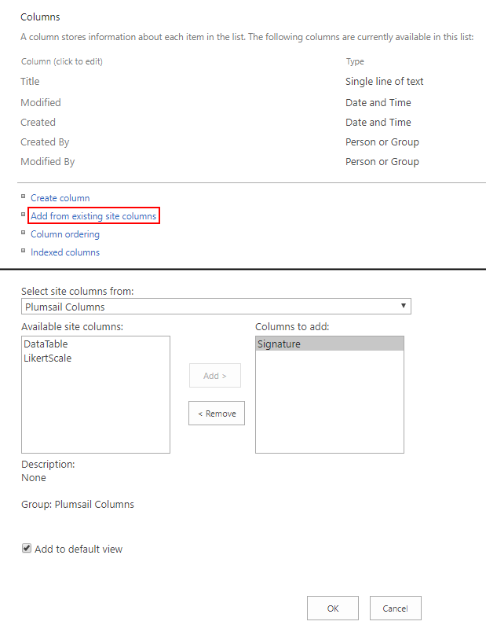
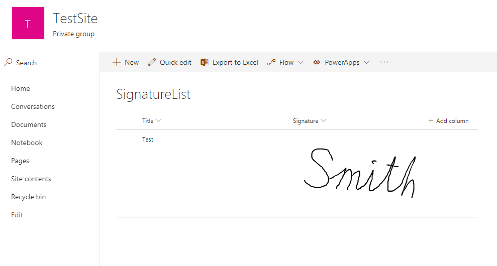
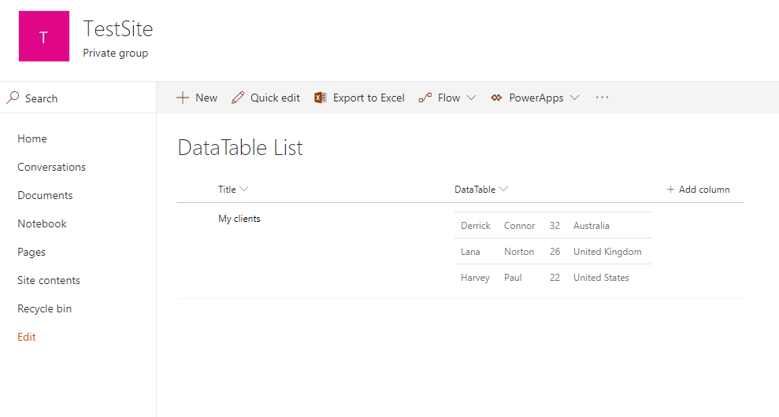
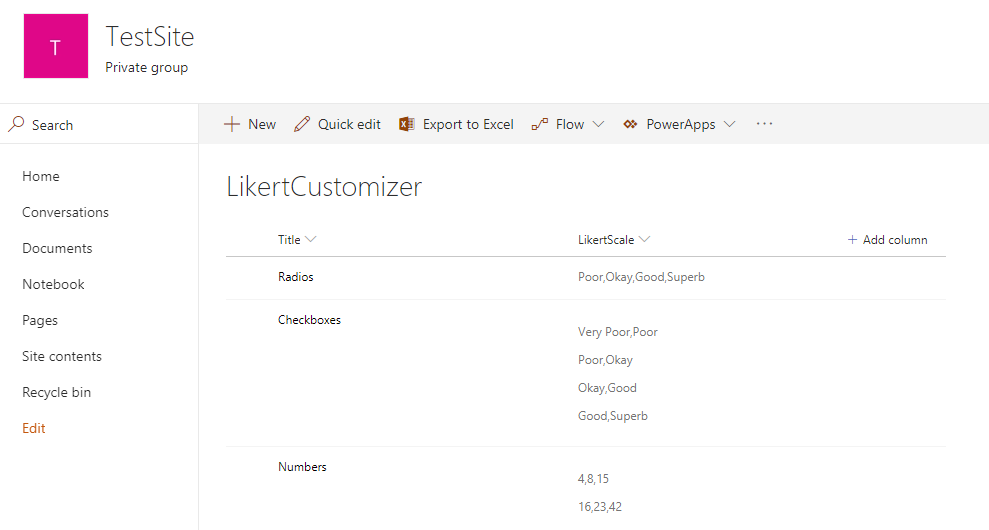

Save Ink Sketch, DataTable, and Likert scale controls to SharePoint fields + List View Rendering
=================================================================================================

.. contents:: Contents:
 :local:
 :depth: 1

Description
--------------------------------------------------
Starting with version 1.1.6, it's now possible to save Ink Sketch and DataTable controls 
to SharePoint fields when using them on a SharePoint Form. This means that the data will be saved when the form is saved.

These fields can be created and deleted right in the designer when editing settings for one of the controls, created fields will be hidden. Alternatively, you can create a new multiple lines Plain Text column and store control's data in it.

How to configure
--------------------------------------------------
Select an Ink Sketch or a DataTable control and you'll see SaveTo property:

.. image:: ../images/how-to/save-table-signature/SaveTo.png
   :alt: SaveTo property

*If the form was created with an older version of Forms, simply delete the control and add it again.*

Inside the dropdown you can select one of existing hidden fields to store data to (it must be a Multiline Text field to work) or create a new field:

.. image:: ../images/how-to/save-table-signature/AddNew.png
   :alt: Add new fields

*New field will be called fd_Signature_InternalName or fd_DataTable_InternalName depending on the type of the field.*

If you want to delete one of the hidden fields, you can do it by selecting "🖉 Manage" option in the dropdown. 

*System fields cannot be deleted this way, but be careful not to delete one of important fields by accident. Old data is not transfered to new field automatically.*

Field Customizers
--------------------------------------------------
If you are looking for ways to display Ink Sketch, DataTable or Likert scale controls on the List View,
we recommend to take a look at the |Field Customizers package|.

.. |Field Customizers package| raw:: html

   <a href="https://github.com/Plumsail/forms-fields#fields-customizers" target="_blank">Field Customizers package</a>

It's a small package, which you can add to your App Catalog, and it will allow you to add new columns to lists or libraries. These columns are designed to visually present Forms' controls in List View.

|pic1|

For example, Ink Sketch field stored in Signature column will show an image in List View:

|pic2|

Data Table column will render an HTML table in List View:

|pic3|

Finally, Likert Scale will allow you to see all the selected options:

|pic4|

You can also clone the repository and use it to customize columns further, or add new Field Customizers, by following this |instruction from Microsoft|.

.. |instruction from Microsoft| raw:: html

   <a href="https://docs.microsoft.com/en-us/sharepoint/dev/spfx/extensions/get-started/building-simple-field-customizer" target="_blank">instruction from Microsoft</a>