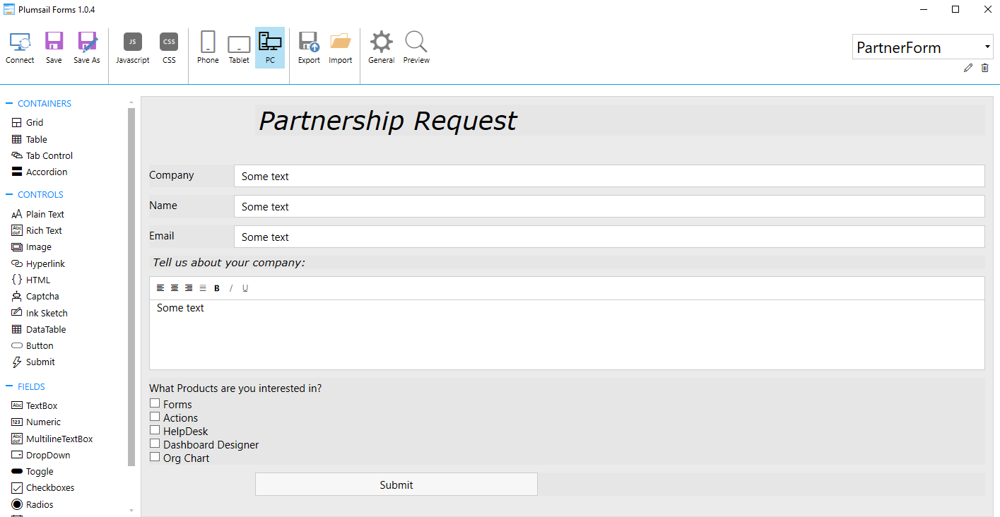
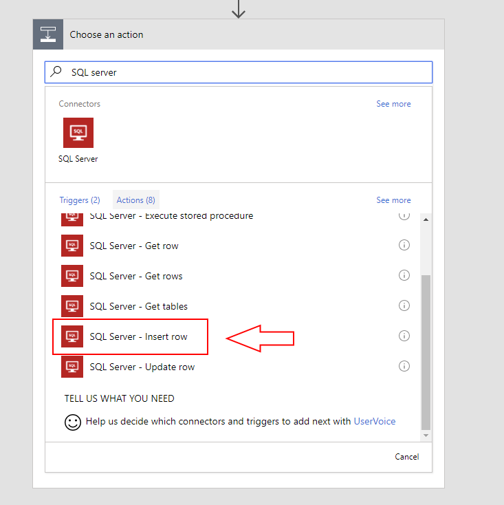
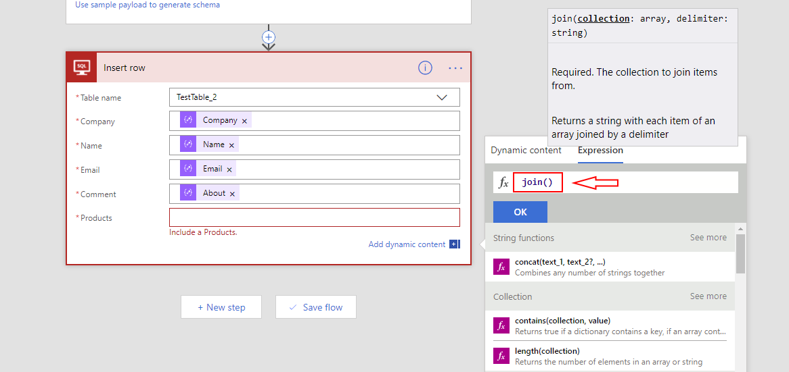
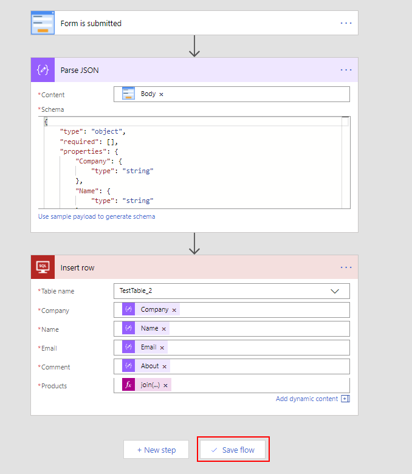
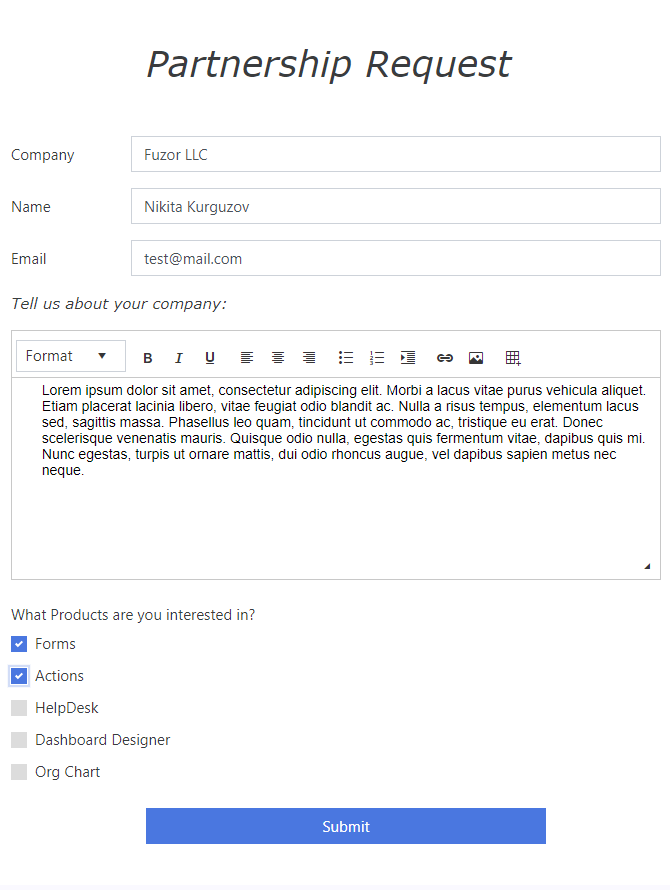
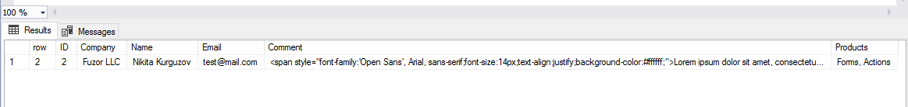

Insert SQL Server records from Form
==================================================

Description
--------------------------------------------------
There are many actions available in Microsoft Flow, including SQL Server actions. 
It's very easy to handle form submissions and add or update records in your database.

In this example, we will create a Partnership Request form for our company Plumsail, 
which anyone who is interested in partnership can fill, very similar to an |Partnership Form|. 
This information will then be handled by MS Flow and new record would be added to SQL Server Database.

.. |Partnership Form| raw:: html

   <a href="https://auth.plumsail.com/account/login" target="_blank">actual form</a>

Form creation and submission
----------------------------------------------------
First, we create a form in the designer. Add all the necessary fields, in this case - Company, Name, Email, About and Products the user can be interested in.

|

We then add new Flow to trigger on form submission and parse JSON from it. Here's how it's done - :ref:`creating-flow`.

SQL Server action
----------------------------------------------------
After adding Parse JSON action and inserting form schema into it, I click New Step button and search for *SQL Server*.

Here, I select *SQL Server - Insert row*:

|

Now, if this is your first time using *SQL Server* actions in MS Flow, you'll need to fill in all the information to establish connection to the database.

Connection name can be anything, it's up to you what to call it. 
Other than that, you'll need to fill in server, login and password, as well as select the specific database to access.

Next, once the connection is established, you'll be able to select Table in the database, and then what information to add to what column.

We'll add our parsed fields from the form to Company, Name, Email and Comment columns, 
but it's important not to add multiple choice Product checkboxes straight inside or the action will loop and add a record for each choice made.

Instead, we'll use Expression **join()** and combine all Product choices into one string:

|

Once I select **join()** expression, I go back to Dynamic content tab, 
click Products to insert field inside the Expression and add a divider to fields from one another:

.. image:: ../images/how-to/sql/4_Products.png
   :alt: join()

|

Final result looks like this and I can save the Flow:

|

Form submission
----------------------------------------------------
So, to test the Flow, I will fill in the Form and submit it, here's an example:

|

I just click submit and here's the entry in the database from the Flow, just a few seconds later:

|