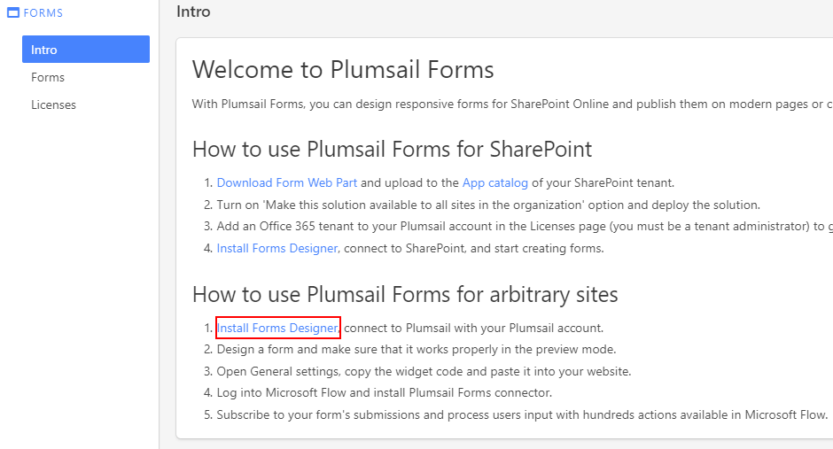

Installation
==================================================

.. contents:: Contents:
 :local:
 :depth: 1

First step - Register a Plumsail Account
--------------------------------------------------
Plumsail Forms product uses our new service called Plumsail Account. Using Plumsail Account you can manage your licenses - for both Modern SharePoint and Public Web Forms, 
and it also stores all your Public Web Forms. All Public Web Forms created by you are tied to your Plumsail Account.

Plumsail Account is a new service we've recently implemented, so even if you were our client for a long time, you still need to register to get an Account. 

Register
**************************************************
You can register by filling out |location_link|.

.. |location_link| raw:: html

   <a href="https://auth.plumsail.com/account/register?ReturnUrl=http://account.plumsail.com/" target="_blank">this small form here</a>

Sign in
**************************************************
You can log in by going to the |location_link2| and entering your login and password. Make sure you've registered first.

.. |location_link2| raw:: html

   <a href="https://auth.plumsail.com/account/login" target="_blank">following page</a>

Download designer and start designing forms
--------------------------------------------------
You can download the designer application from your Plumsail Account in Forms section on the |Intro tab|:

|pic1|

.. |Intro tab| raw:: html

   <a href="https://account.plumsail.com/forms/intro" target="_blank">Intro tab</a>

Download and install the app, the process is very simple. Press *Run* and follow the instructions: 

|pic2|

.. |pic2| image:: ./images/start/run-installer.png
   :alt: Run the installer

After that, you can start designing your own custom forms. Find more about how to design Public Web Forms with the designer in this article.